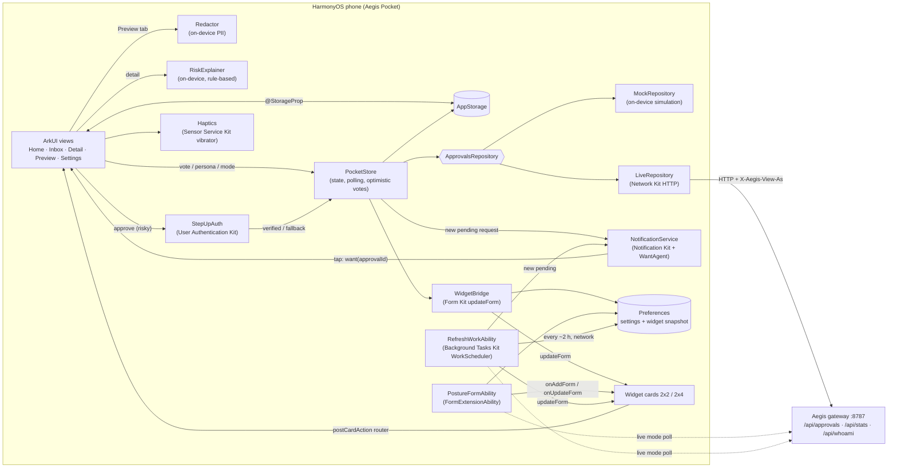

> **This repository contains two HackYeah 2026 submissions.**
> **Huawei "Imagine What's Next": Aegis Pocket**, the native HarmonyOS app at the repository root (this README).
> **Goldman Sachs: Aegis**, the local-first AI guardrails gateway in [`aegis/`](aegis/) (see [`aegis/README.md`](aegis/README.md)).

# Aegis Pocket: Approve AI Agents

A native **HarmonyOS** app (ArkTS + ArkUI, API 20+) that puts a human back in the loop for AI agents.
When an agent governed by the [Aegis](#how-to-point-it-at-the-aegis-gateway) gateway wants to do something
risky (buy a $50 SaaS subscription, read a customers table with personal data, raise a team budget),
the request shows up as a **notification** on the phone. You **approve or deny** it according to your
role (member / admin / owner), and risky approvals need your **face, fingerprint or PIN** (User Authentication
Kit step-up). An on-device **risk explanation** says in plain words why the gateway asked a human. A **home-screen
service widget** shows live AI security posture (blocked
threats, redacted personal data, budget left, pending approvals), and an **on-device preview** shows
exactly which personal data would leave the device before a prompt is sent to an AI model.

Submission for **HackYeah 2026, Huawei partner task "Imagine What's Next"**. Lead theme: **Human-Centric
Technology** (human oversight of autonomous AI agents, privacy-first, accessible), with an **Intelligent
Experiences** angle (on-device risk explanation for AI agent requests). Organizers' repository:
<https://github.com/onirodeveloper/hackyeah2026-challenge>.

| | |
|---|---|
| Language / UI | ArkTS + ArkUI (declarative, state management V1) |
| App model | Stage model (`UIAbility` + `FormExtensionAbility` + `WorkSchedulerExtensionAbility`) |
| SDK levels (`build-profile.json5`) | compatible (minimum) **API 20** `6.0.0(20)`, compile **API 24** `6.1.1(24)`, target **API 24** `6.1.1(24)` |
| Runtime | `runtimeOS: "HarmonyOS"`, device type `phone` |
| Deliverable | `.hap` (module `entry`) |
| Bundle name | `com.hackyeah.aegispocket` |
| Build system | hvigor + ohpm (driven by `devecocli`) |

> Compile SDK note: DevEco Studio 6.1.1 bundles only the `6.1.1(24)` SDK, so `compileSdkVersion` is `6.1.1(24)`
> (with `6.1.0(23)` hvigor fails with "SDK component missing"). The minimum stays API 20.

## What it does (demo flow)

1. **Home** shows how many requests are waiting and the posture KPIs (threats blocked, personal data redacted,
   budget left, agent requests) plus the two most urgent requests.
2. A new agent request arrives (mock mode: every 20-30 s; live mode: polled from the gateway every 4 s). The app posts a
   **notification** ("Approval needed: requires admin ..."), shows an in-app banner and updates the **widget**.
3. Tapping the notification opens the request **detail**: amount, requester agent and its sponsor, a **"Why a human
   is asked"** risk card (score 0-100 with plain-language reasons, computed on the device), required role, expiry
   countdown, facts, policy checks, the agent's note (labelled *agent-supplied, untrusted*, never scored) and votes.
4. **Approve / Deny** are enabled only when the selected persona may vote. Otherwise they are locked with the
   reason (for example "Requires owner (you are admin)" or "Separation of duties: you requested or sponsor this").
   **Approve** on an admin- or owner-level request, a two-person request, or anything from $100 first opens the
   system **face / fingerprint / PIN** sheet (User Authentication Kit, ATL3). Where no authenticator exists (the DevEco
   emulator cannot simulate biometrics) a dialog titled *"Device authentication unavailable"* offers a clearly labelled
   **manual fallback**. Deny never needs it (fail-safe direction). Approve and deny give distinct **haptic** cues.
   Votes are **optimistic** (the card updates at once) and are rolled back with a toast if the gateway refuses.
5. Switch persona in the **Inbox** (Piotr = member, Emily / Marek = admin, Katarzyna = owner) to see the role
   rules: the $50 subscription needs an admin, the $480 one needs owner + admin (two-person rule), the budget raise
   60 to 150 needs the owner, reading the PII customers table needs an admin.
6. **Preview** ("What data leaves"): paste text, see emails, phone numbers, PESEL, IBAN and card numbers replaced by
   `[EMAIL_1]`, `[PESEL_1]` ... placeholders. Runs fully on the device.

## Platform capabilities used

Paths are relative to `entry/src/main/ets/` unless they start with `entry/` or `resources/`.

| Capability | Kit / API | Where |
|---|---|---|
| **Step-up authentication** before risky approvals (face / fingerprint / lock-screen PIN, trust level ATL3, random challenge), availability probe, labelled manual fallback | User Authentication Kit: `userAuth.getAvailableStatus`, `userAuth.getUserAuthInstance` + `on('result')` + `start()`, `UserAuthResultCode`; Crypto Architecture Kit `cryptoFramework.createRandom` (challenge) | `platform/StepUpAuth.ets`, `views/DetailView.ets` (`stepUpThenVote`, `confirmFallback`), policy `data/Eligibility.ets` (`needsStepUp`) |
| **Background refresh** of the widget and notifications for new live requests while the app is closed (repeating, network-gated deferred task) | Background Tasks Kit: `workScheduler.startWork`, `WorkSchedulerExtensionAbility` (`onWorkStart`) | `platform/BackgroundRefresh.ets`, `workscheduler/RefreshWorkAbility.ets`, `entry/src/main/module.json5` |
| **Haptic feedback** on approve / deny / new request (system preset effects `haptic.notice.*` with timed fallback) | Sensor Service Kit: `vibrator.isSupportEffectSync`, `vibrator.startVibration` | `platform/Haptics.ets` |
| **Accessibility**: screen-reader labels and descriptions on the approve / deny buttons, request cards, tabs, filters, persona switcher, risk card; font sizes in `fp` follow the system font scale, action buttons use `minHeight` so large fonts do not clip | ArkUI `accessibilityText`, `accessibilityDescription`, `accessibilityGroup`, `constraintSize` | `views/DetailView.ets`, `components/Common.ets`, `pages/Index.ets`, `views/InboxView.ets`, `views/SettingsView.ets` |
| Home-screen **service widgets** (2x2 and 2x4), updated from the app and every 30 min | Form Kit: `FormExtensionAbility`, `formProvider.updateForm`, `formProvider.getPublishedRunningFormInfos` (API 20), `formBindingData`, ArkTS card with `postCardAction` router | `formability/PostureFormAbility.ets`, `widget/pages/*.ets`, `platform/WidgetBridge.ets`, `resources/base/profile/form_config.json` |
| **Local notifications** for new approval requests, permission dialog, tap-to-open | Notification Kit: `notificationManager.requestEnableNotification(context)`, `publish`, `cancel`; Ability Kit `wantAgent` (START_ABILITY with the approval id) | `platform/NotificationService.ets`, `entryability/EntryAbility.ets` (`onNewWant`) |
| HTTP client to the Aegis gateway (`X-Aegis-View-As` persona header, error envelopes) | Network Kit: `http.createHttp().request` | `data/LiveRepository.ets` |
| Persistent settings shared with the widget process | ArkData Preferences | `platform/SettingsStore.ets`, `platform/WidgetBridge.ets` |
| UI: `Navigation` + `NavDestination`, `Tabs`, `Refresh`, `List`, transitions, implicit and explicit animations, dark theme | ArkUI | `pages/Index.ets`, `views/*`, `components/Common.ets` |

Permissions (all `system_grant`, normal APL, available to ordinary apps; checked against the SDK's
`PermissionDefinitions.json`): `ohos.permission.INTERNET` (live mode), `ohos.permission.ACCESS_BIOMETRIC` (step-up
authentication), `ohos.permission.VIBRATE` (haptics). The deferred task needs no permission. Notifications are
enabled through the system dialog. No location, contacts, camera or other sensitive permission.

**Intelligent touch, on the device.** `data/RiskExplainer.ets` turns the gateway's policy data (the control that
fired, for example `ACT-01` spend guard or `EXE-03` taint-flow breaker; amount; approval level; failed checks;
production environment; sensitive data words) into a 0-100 score and readable reasons. It is deterministic and
rule-based (no model, no network), and the agent's own note is never scored because it is untrusted text.

## Mock mode vs live mode

| | Mock mode (default) | Live mode |
|---|---|---|
| Data | **Simulated on the device** (`data/MockRepository.ets`): seeded requests from the demo script, a new fictional agent request every 20-30 s, drifting posture KPIs. Clearly labelled **MOCK MODE** in the app header and **MOCK** on the widget | Aegis gateway REST API: `GET /api/approvals?status=all`, `GET /api/stats?window=24h`, `GET /api/whoami`, `POST /api/approvals/{id}/approve` / `deny` |
| Role rules | Mirrored on the device (`data/Eligibility.ets`, same rules as the gateway's Addendum A-20) | Enforced by the gateway (`can_vote` / `why_not`, 403 / 409 answers) |
| Network | None | HTTP polling every 4 s (SSE `GET /api/events` is not used yet) |
| Widget | Snapshot pushed by the app | Snapshot pushed by the app; the widget extension (30-min update) and the WorkScheduler task (about every 2 h, system-scheduled) also poll the gateway while the app is closed |
| Step-up authentication | Same as live (it is a device feature, not mock data) | User Authentication Kit sheet; manual fallback only when the device has no authenticator |

All mock data (agents, vendors, amounts, people) is fictional. The sample text in the Preview tab uses synthetic
identifiers that only pass the checksums.

### How to point it at the Aegis gateway

1. Start the Aegis gateway on your computer. It is the Goldman Sachs submission in [`aegis/`](aegis/) and listens on
   port **8787** (`127.0.0.1` by default):
   ```bash
   cd aegis && make up                       # gateway + mocks; see aegis/README.md for setup
   AEGIS_HOST=0.0.0.0 make up                # instead, when a phone on Wi-Fi must reach it (trusted networks only)
   ```
2. In the app open **Settings**, enter the gateway URL and tap **Test connection**:
   - DevEco **emulator**: `http://10.0.2.2:8787` (the default; the emulator's alias for the host). If that does not
     connect, use your computer's LAN IP, for example `http://192.168.1.20:8787`, and make sure the gateway listens on
     that interface, not only on `127.0.0.1`.
   - **Phone** on the same Wi-Fi: `http://<computer-LAN-IP>:8787`.
3. Tap **Live gateway**. The header badge turns green (**LIVE**), or red (**LIVE · OFFLINE**) with the error message
   when the gateway cannot be reached. Cleartext HTTP is allowed by default on HarmonyOS (no `network_config.json`).
4. Pick the persona you want to act as; it is sent as `X-Aegis-View-As`.

## 1. Repository layout

```
.
├── AppScope/                       # App-wide config: app.json5 (bundleName, version, icon, label) + resources
├── entry/                          # The single HAP module (type: entry)
│   ├── src/main/
│   │   ├── module.json5            # Abilities, form + workScheduler extensions, permissions
│   │   ├── ets/entryability/       # EntryAbility: init store, notification permission, deep links (onNewWant)
│   │   ├── ets/pages/Index.ets     # Navigation + Tabs (Home / Inbox / Preview / Settings), in-app banner
│   │   ├── ets/views/              # HomeView, InboxView, DetailView (NavDestination), PreviewView, SettingsView
│   │   ├── ets/components/         # Shared UI: ApprovalCard, PersonaSwitcher, KpiTile, ModeBadge, Pill
│   │   ├── ets/data/               # ApprovalsRepository, Mock/LiveRepository, Eligibility (+ step-up rule), RiskExplainer, PocketStore
│   │   ├── ets/model/              # UI models (Models.ets) and gateway wire types (Wire.ets)
│   │   ├── ets/platform/           # StepUpAuth, Haptics, BackgroundRefresh, NotificationService, WidgetBridge, SettingsStore
│   │   ├── ets/workscheduler/      # RefreshWorkAbility (WorkSchedulerExtensionAbility)
│   │   ├── ets/redaction/          # On-device PII redactor (EMAIL, PHONE, PESEL, IBAN, PAN)
│   │   ├── ets/formability/        # PostureFormAbility (FormExtensionAbility)
│   │   ├── ets/widget/pages/       # ArkTS widget cards: PostureCard (2x2), PostureWideCard (2x4)
│   │   └── resources/              # Strings, colors, profile/form_config.json, profile/main_pages.json
│   ├── src/test/                   # Local unit tests (hypium, run on the host): Redactor, Eligibility, StepUpRisk
│   └── src/ohosTest/               # Instrumented tests (template)
├── build-profile.json5             # SDK versions, products, (empty) signing configs, modules
├── code-linter.json5               # ArkTS linter rules
├── AGENTS.md, CLAUDE.md, GEMINI.md # Agent guidance (organizers' Hackathon Template)
├── HACKATHON_BRIEF.md              # Submission brief
├── AI_WORKFLOW.md                  # AI tools, prompts, work log, validation
├── hackathon-resources/            # Organizers' bundled reference
├── scripts/                        # macOS helpers: DevEco region switch, DevEco template install
├── docs/HACKTRIBE_POCKET.md        # Submission text and demo video script
├── aegis/                          # Separate submission (Goldman Sachs): the Aegis gateway
└── README.md
```

## 2. Prerequisites

| Tool | Version | Notes |
|---|---|---|
| macOS (Apple Silicon) | 27 | Development machine. The DevEco Studio emulator needs Apple Silicon |
| DevEco Studio | 6.1.x (data directory `DevEcoStudio6.1`) | Bundles the HarmonyOS SDK, hvigor, ohpm, hdc and the emulator. Install into `/Applications` |
| HarmonyOS SDK | 6.1.1(24) | Bundled with DevEco Studio 6.1.1 (`Contents/sdk/default`); used as compile/target SDK, minimum API 20 |
| Node.js | 22 or later (tested with 24.10) | Required by `devecocli`. Keep your own Node first on `PATH`, not DevEco's bundled `tools/node` |
| Python 3 | any 3.x | Some agent skills call the `python` command |
| Java | any recent JDK on `PATH` | hvigor starts a small Java helper daemon during builds |
| Git | any recent | |

> Local machine-specific toolchain files go in `.toolchain/`, which is git-ignored.

## 3. Setup

The organizers' automated installer ([`INSTALLATION_PROMPT.md`](https://github.com/onirodeveloper/hackyeah2026-challenge/blob/main/INSTALLATION_PROMPT.md))
supports Windows only. On macOS their README and FAQ say to do the same steps by hand. The steps below are that
macOS path. The two scripts in `scripts/` automate the manual parts. Neither script uses sudo.

```bash
git clone https://github.com/JustAnotherDevv/tiles-hackyeah-2026.git
cd tiles-hackyeah-2026
# The organizers' repository provides the skills, the DevEco CLI patches and the templates:
git clone --depth 1 https://github.com/onirodeveloper/hackyeah2026-challenge /tmp/hy-challenge
```

### 3.1 DevEco Studio and the emulator

1. **Install DevEco Studio 6.1** into `/Applications`. See the
   [Oniro DevEco Studio installation guide](https://docs.oniroproject.org/application-development/environment-setup-guide/deveco-studio/installation/).
2. **First launch.** Start DevEco Studio once, finish the first-launch setup (including the SDK download), then
   quit it (Cmd+Q). This step creates `~/Library/Application Support/Huawei/DevEcoStudio6.1/options/country.region.xml`.
3. **Switch the region to China.** Outside China, Device Manager only offers smart-watch emulators. With the
   region set to CN it also offers phone, tablet, 2-in-1 and TV emulators.
   ```bash
   scripts/set-deveco-region-cn.sh --dry-run   # shows the change
   scripts/set-deveco-region-cn.sh             # backs up the file, sets <countryregion name="CN"/>
   ```
   The script reads `dataDirectoryName` from the app's `product-info.json`. It refuses to run while DevEco Studio is
   running and never creates the file. This follows the organizers' [FAQ](https://github.com/onirodeveloper/hackyeah2026-challenge/blob/main/FAQ.md#how-do-i-switch-the-deveco-studio-region-to-china-manually).
4. **Create and start an emulator** (GUI only; the agent cannot do this). Start DevEco Studio, open Device Manager,
   create a **Phone** device, download its system image (newest available, API 24; several GB) and start it. With
   8 GB RAM, close other heavy apps first. See the [Oniro emulator guide](https://docs.oniroproject.org/application-development/environment-setup-guide/deveco-studio/emulator/).
5. *(Optional)* **Install the organizers' project templates** (`Hackathon Template`, `Conductor Hackathon Template`)
   into DevEco's Create Project wizard. This repository already contains the Hackathon Template files, so you only
   need the templates to create new projects.
   ```bash
   scripts/install-deveco-templates.sh --source /tmp/hy-challenge --dry-run
   scripts/install-deveco-templates.sh --source /tmp/hy-challenge
   ```
   Target directory: `<DevEco Studio>.app/Contents/plugins/openharmony/lib/templates/project`. This is the macOS
   equivalent of the organizers' Windows path `<DevEcoStudioRoot>\plugins\openharmony\lib\templates\project`.
   The script does not overwrite or merge an existing template that differs. If macOS reports
   "Operation not permitted", allow your terminal under System Settings > Privacy & Security > App Management.
   Restart DevEco Studio afterwards.
6. **Open this project.** In DevEco Studio choose File > Open and select this folder. Let it sync and accept the SDK
   prompts. DevEco creates `local.properties` (git-ignored), which points at your SDK. Then restore dependencies:
   ```bash
   ohpm install            # restores oh_modules/ (hypium, hamock)
   ```
   (`devecocli build` also runs `ohpm install` for you.) Verified paths with DevEco Studio 6.1.1: DevEco puts its tools under
   `<DevEco Studio>.app/Contents/tools/{ohpm,hvigor}/bin` and `hdc` under
   `<DevEco Studio>.app/Contents/sdk/default/openharmony/toolchains`. You can add these directories to `PATH`, but
   do not add `Contents/tools/node`.

### 3.2 Agent tooling (Claude Code)

We use **Claude Code** (model Claude Opus 5.5) with **parallel sub-agents** (see [AI_WORKFLOW.md](AI_WORKFLOW.md)).
The tooling is installed **for this project**, not in the user-level agent configuration.

**Agent skills.** The organizers' nine skills are copied unmodified into `.claude/skills/`, where Claude Code loads
project skills. The folder is git-ignored because it holds about 26 MB of third-party content. To restore it:

```bash
mkdir -p .claude/skills && cp -R /tmp/hy-challenge/skills/* .claude/skills/
```

| Skill | Purpose |
|---|---|
| `ohos-app-scaffold` | Creates a new, untouched project skeleton and stops |
| `ohos-app-dev` | Inner dev loop for an existing app: lint, build, run, logs, UI checks |
| `ohos-system-app-dev` | Privilege preflight and dev loop for apps that may need system-app identity |
| `ohos-system-dev` | Platform components built inside the OpenHarmony source tree |
| `conductor-dev` | Conductor orchestration. Not used with this template (see `AGENTS.md`) |
| `hmos-arkts-knowledge-retriever` | Grounded ArkTS and API references |
| `hmos-arkui-scenario-development` | Scenario-based ArkUI development (REQ, DEV, FIX, VAL) |
| `hmos-arkui-develop-skill` | ArkUI pages, components, layout and state |
| `hmos-arkui-mvvm-pattern` | MVVM layering and refactoring |

**DevEco CLI.** Install `@deveco/deveco-cli` **exactly 1.3.4**, because the organizers' patches are verified only
against that version. The package pins its companion `@deveco/deveco-cli-common` to 1.3.4. Then apply the patches.
They fix the linter wording and disable a Windows memory sampler.

```bash
npm install -g @deveco/deveco-cli@1.3.4
node /tmp/hy-challenge/scripts/apply-devecocli-patches.mjs   # "Applied DevEco CLI 1.3.4 patches at ..."
node /tmp/hy-challenge/scripts/apply-devecocli-patches.mjs   # must say "patches are already applied"
devecocli -V                                                 # 1.3.4
```

`devecocli` is installed into `$(npm config get prefix)/bin`, which must be on `PATH`. To opt out of the CLI's
telemetry, set `export DEVECO_CLI_DISABLE_TELEMETRY=1`.

**DevEco CLI skill** (after DevEco Studio is installed, because the CLI refuses to run without it). Install it into
this project only:

```bash
devecocli init --skill --agent claude-code --project .   # writes .claude/skills/deveco-cli/SKILL.md
```

Without `--agent`/`--project`, `init` writes into the global configuration of every agent it detects.

Restart Claude Code after installing skills so that it loads them.

## 4. Signing

Installing a `.hap` on the emulator or a device needs a debug signature. An unsigned `.hap` builds but will not install.

1. DevEco Studio > File > Project Structure > Signing Configs > tick **Automatically generate signature**.
   For a HarmonyOS (`runtimeOS: "HarmonyOS"`) project this needs a Huawei ID sign-in.
2. DevEco writes the keys and certificates to `~/.ohos/config/` (outside the repo). It also fills
   `app.signingConfigs` in `build-profile.json5` with **absolute local paths and encrypted passwords**.
3. **Do not commit that block.** Before committing, check `git diff build-profile.json5` and revert
   `signingConfigs` to `[]` (or use `git add -p`). `*.p12`, `*.cer`, `*.p7b` and similar files are git-ignored.

To reproduce from a clean checkout, sign with **your own** Huawei ID (step 1) and build; the signed debug `.hap` only
installs on emulators/devices covered by that profile. A signed debug build from the team is attached to the GitHub
Release for convenience (debug profiles expire after about 14 days, see the organizers' FAQ "Signing").

## 5. Build

Verified on macOS 27 (Apple Silicon) with DevEco Studio 6.1.1 and `devecocli` 1.3.4:

```bash
export DEVECO_CLI_DISABLE_TELEMETRY=1
devecocli build --modules entry --build-mode debug     # runs ohpm install + hvigor; exit code 0 = success
```

Output: `entry/build/default/outputs/default/entry-default-unsigned.hap` (no signing configured), or
`entry-default-signed.hap` after you set up signing (section 4).

Without `devecocli`, call DevEco's bundled hvigor directly:

```bash
DEVECO=/Applications/DevEco-Studio.app/Contents
"$DEVECO/tools/node/bin/node" "$DEVECO/tools/hvigor/bin/hvigorw.js" \
  --mode module -p module=entry@default -p product=default -p buildMode=debug assembleHap
"$DEVECO/tools/node/bin/node" "$DEVECO/tools/hvigor/bin/hvigorw.js" --stop-daemon   # free RAM afterwards
```

Lint: `devecocli check lint --format json "$(pwd)"` (0 errors; the remaining warnings are the
`avoid-overusing-custom-component-check` performance hint for small reusable components that need reactive `@Prop`s).

## 6. Install

```bash
HDC=/Applications/DevEco-Studio.app/Contents/sdk/default/openharmony/toolchains/hdc
$HDC list targets                                  # the emulator/device must be listed
$HDC install -r entry/build/default/outputs/default/entry-default-signed.hap
```

Or `devecocli run --skip-build --module entry --device <name>`. An unsigned `.hap` builds but does not install;
see section 4 for the debug signature. The emulator must be created and running first (section 3.1 step 4).

## 7. Launch

```bash
$HDC shell aa start -a EntryAbility -b com.hackyeah.aegispocket
$HDC hilog | grep AegisPocket                      # app logs (tag AegisPocket)
```

To exercise the background refresh without waiting for the system scheduler (organizers' docs, WorkScheduler service
id 1904):

```bash
$HDC shell "hidumper -s 1904 -a '-t com.hackyeah.aegispocket RefreshWorkAbility'"
$HDC hilog | grep -E "RefreshWorkAbility|Background"
```

Or tap **Aegis Pocket** on the launcher. On first start the app asks to allow notifications. To add the widget:
long-press the home screen, open **Service widgets**, choose **Aegis Pocket**, then **AI posture** (2x2) or
**AI posture (wide)** (2x4). Tapping the widget opens the Inbox.

## 8. Tests

```bash
DEVECO=/Applications/DevEco-Studio.app/Contents
"$DEVECO/tools/node/bin/node" "$DEVECO/tools/hvigor/bin/hvigorw.js" --mode module -p module=entry@default -p product=default test
grep "Tests run" entry/.test/default/intermediates/test/coverage_data/test_result.txt
# Tests run: 17, Failure: 0, Error: 0, Pass: 17, Ignore: 0
```

Local unit tests (`entry/src/test`) cover the redactor (PESEL / Luhn / IBAN checksums, stable placeholders,
invalid numbers left alone, PCI masking), the approval eligibility rules (admin level, separation of duties,
owner level, two-person rule), the step-up rule ($100 threshold, admin/owner/two-person) and the risk explainer
(low / medium / high levels, the agent's note never changes the score). Instrumented tests (`entry/src/ohosTest`) are still the template.

## 9. Architecture



- **Data flow.** `PocketStore` (singleton, MVVM service layer) polls the active repository every 4 s, maps results to UI
  models (`model/Models.ets`) and publishes them to `AppStorage`; views bind with `@StorageProp`. Wire types from the
  gateway contract live in `model/Wire.ets` and are mapped in `LiveRepository.map`, so views never see the wire format.
- **New requests.** The store remembers seen ids; each new pending request triggers a Notification Kit notification
  (WantAgent → `EntryAbility.onNewWant` → `AppStorage.openApprovalId` → `Index` pushes the detail page) and an in-app banner.
- **Votes.** Optimistic update, then `POST .../approve|deny`; on 403 (`forbidden`, with the gateway's reason), 409
  (already decided) or a network error the card is rolled back and a toast shows the message.
- **Widgets.** After each refresh `WidgetBridge` writes a snapshot to Preferences and calls `formProvider.updateForm` for
  every placed widget (`getPublishedRunningFormInfos`). The `FormExtensionAbility` serves the snapshot on add and on its
  30-minute update (and polls the gateway itself in live mode).
- **Step-up.** `DetailView.vote('approve')` checks `needsStepUp` (admin/owner level, two-person rule, or >= $100). It
  probes `userAuth.getAvailableStatus` for face, fingerprint and PIN at ATL3, opens the system sheet with a 32-byte random
  challenge and only then calls `PocketStore.vote`. Result codes are mapped in `StepUpAuth.outcomeOf`: success approves,
  cancel / lockout / timeout abort with a toast, "not enrolled / not supported" falls back to the labelled manual
  confirmation dialog. Denials skip step-up on purpose.
- **Background.** `EntryAbility.onCreate` registers a repeating, network-gated WorkScheduler task (`isPersisted`, 2 h
  cycle; the system decides the real cadence from the app's activity group). `RefreshWorkAbility.onWorkStart` runs
  `BackgroundRefresh.refreshOnce`: in live mode it polls the gateway, updates every placed widget and notifies about
  pending requests not yet seen in the app (the app records the ids it has shown); in mock mode it re-sends the last
  snapshot. The widget's own `onUpdateForm` uses the same code path.
- **Errors.** Network failures switch the header badge to **LIVE · OFFLINE** and keep showing the last data; the widget keeps
  its last snapshot. Settings validate the URL before saving.
- **Privacy.** The Preview tab's redactor runs in ArkTS on the device (no network, nothing stored). Logs (`AegisPocket` tag)
  never contain request payloads.

## 10. AI features

Not applicable inside the app: Aegis Pocket contains no AI model and sends no data to an AI service. The
"Why a human is asked" risk card is rule-based (see "Intelligent touch" above), not machine learning. It is the human
approval front end for AI agents that are governed by the separate Aegis gateway. The "What data leaves" preview is
rule-based (regular expressions plus checksums: PESEL weights, Luhn, IBAN mod-97), runs on the device, and mirrors the
gateway's local-first redaction (entity names and `[ENTITY_N]` placeholders from the gateway contract). Development
used AI tools; see [AI_WORKFLOW.md](AI_WORKFLOW.md).

## Known limitations

- Install, launch, notifications, widgets, step-up authentication, haptics and the WorkScheduler task have **not yet
  been verified on an emulator or device** (no target was available when this version was built). Build, lint and
  unit tests pass.
- The DevEco emulator cannot simulate biometrics or vibration (organizers' FAQ). On it, step-up uses the lock-screen
  PIN if one is set, otherwise the labelled manual fallback; haptics are silently skipped.
- In-app polling only runs while the app is alive. While it is closed, the WorkScheduler task refreshes the widget and
  notifies about live requests at most about every 2 hours (system-scheduled), so it is a safety net, not real-time.
  Push Kit or SSE would make background delivery immediate.
- Mock mode re-seeds on every app start; a notification for a simulated request from a previous run opens "Request not found".
- Phone only (`deviceTypes: ["phone"]`); no wearable target yet.

## 11. Switching runtime: HarmonyOS vs OpenHarmony

The skeleton targets the **HarmonyOS** SDK. That is DevEco's default, and the DevEco emulator on macOS only
runs HarmonyOS projects. To build against the **OpenHarmony** SDK instead (for example for an OpenHarmony or Oniro
board), change the product in `build-profile.json5`:

```json5
"compileSdkVersion": 23,
"compatibleSdkVersion": 20,
"targetSdkVersion": 23,
"runtimeOS": "OpenHarmony",
```

The OpenHarmony runtime uses integer API levels. The HarmonyOS runtime uses release labels:
`"6.0.0(20)"`, `"6.1.0(23)"`, `"6.1.1(24)"`. The Oniro emulator runs OpenHarmony 6.1 (API 23), so do not rely on
API 24 behaviour there.
Only `@ohos.*` / OpenHarmony APIs are available there. HarmonyOS-only Kits are not.

## Demo (≤60 s)

Recorded on the DevEco phone emulator in mock mode (label visible), widget already placed on the home screen.

| Time | Shot | What to say / show |
|---|---|---|
| 0-6 s | Home screen with the **AI posture** widget (MOCK badge), tap it | "AI agents now act for us. Aegis Pocket puts a human in the loop, on HarmonyOS." |
| 6-14 s | App Home: pending count, blocked threats, redacted data, budget left | Posture at a glance; the same numbers the widget shows (Form Kit). |
| 14-22 s | A simulated request arrives: system **notification** + in-app banner; tap the notification | Notification Kit + WantAgent deep link straight into the request. |
| 22-32 s | Detail: **Why a human is asked** card (score, reasons), facts, checks, untrusted agent note | On-device risk explanation; the agent's own note is never trusted. |
| 32-38 s | Inbox: switch persona Emily (admin) → Piotr (member); Approve becomes **LOCKED** with the reason | Role rules and separation of duties. |
| 38-50 s | As Emily, tap **Approve** on the $50 subscription → face/fingerprint/PIN sheet (or the labelled fallback dialog on the emulator) → approved toast | User Authentication Kit step-up before risky approvals; denials never need it. |
| 50-56 s | **Preview** tab: paste text, see `[EMAIL_1]`, `[PESEL_1]` placeholders | Exactly what data would leave the device, computed on the device. |
| 56-60 s | Back to the widget: pending count dropped | Widget kept current by the app and a WorkScheduler background task. |

The full script with voice-over is in [`docs/HACKTRIBE_POCKET.md`](docs/HACKTRIBE_POCKET.md).

---

## Huawei judging checklist

Judging weights: Originality 20, Usefulness 20, Technical execution 20, Platform use 20, Demo 10, Reproducibility 10.
They prefer a **narrow, working** solution over a broad concept.

- [ ] **Public repository**, with commit history that shows progress (small, frequent commits)
- [ ] **Reproducible instructions** for setup, build, install and launch (sections 3 to 7; build verified, install/launch still to verify on the emulator)
- [ ] **Working `.hap`**, API 20+, running on an OpenHarmony/HarmonyOS emulator or device (attach it to a GitHub Release)
- [ ] **Short recorded demo** of the app running on an emulator/device (link here: TODO)
- [x] **Architecture description** (section 9)
- [ ] **`AI_WORKFLOW.md`**: models, agents, MCP servers, main prompts, workflow, validation, lessons learned
- [x] **AI feature docs**, if the app has AI features (section 10: not applicable)
- [x] Real use of **platform APIs/Kits** (User Authentication Kit, Form Kit widgets, Notification Kit, Background Tasks Kit, Sensor Service Kit, Network Kit, ArkData, ArkUI accessibility)
- [x] Theme fit: Human-Centric (human oversight, privacy, accessibility) + Intelligent (on-device risk explanation)
- [x] Error handling and **tests** (`entry/src/test`: 17 local unit tests)
- [ ] **No secrets in the repo**: no signing material, API keys or `signingConfigs` with local paths
- [ ] Pre-existing work separated from hackathon work. Significant AI use disclosed.
