> **This repository contains two HackYeah 2026 submissions.**
> **Huawei "Imagine What's Next": Tiles**, the native HarmonyOS app at the repository root (this README).
> **Goldman Sachs: Aegis**, the local-first AI guardrails gateway in [`aegis/`](aegis/) (see [`aegis/README.md`](aegis/README.md)).

# Tiles: A Phone That Adapts

**Problem.** Phones are designed for one kind of user. A 78-year-old misses small buttons, a child needs limits and
a parent in the loop, a low-vision user needs everything spoken, and scammers target the most vulnerable.
Accessibility settings exist, but people rarely find them and nobody tunes them over time.

**Solution.** Tiles is a native HarmonyOS app that reshapes the phone around the person. The home is a grid of big,
live, colorful tiles that rebuilds itself for a senior, a child, a low-vision user or an everyday user. Ask in plain
words and an on-device assistant generates a new tile that ArkUI renders natively. Tiles learns from use (missed
taps, unused apps) and proposes changes that a caregiver approves from their own phone. Guardian flags scam calls on
the device and turns them into one calm instruction. Aegis, our local-first guardrail layer, is designed to keep
future AI features safe on the device.

<p align="center">
  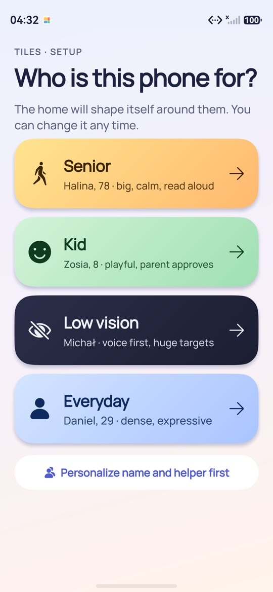
  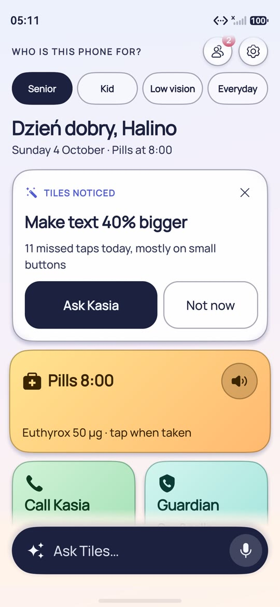
  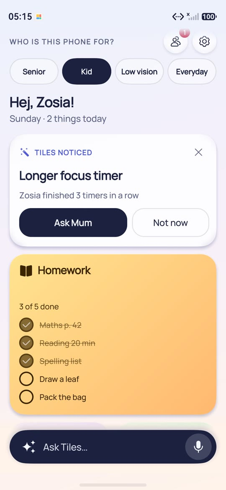
  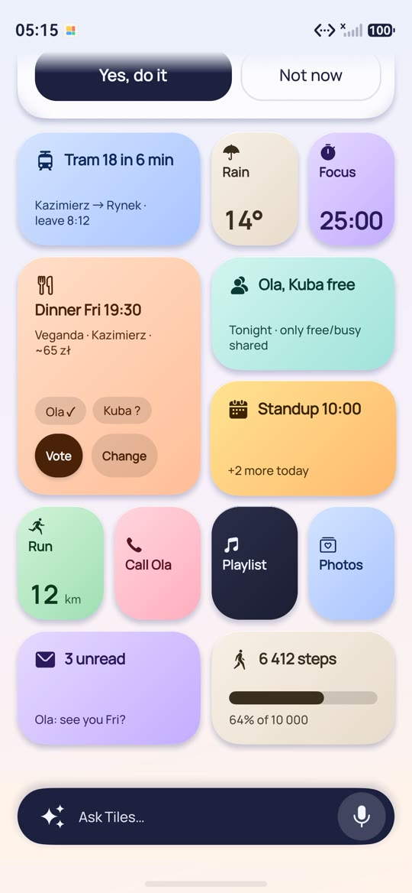
  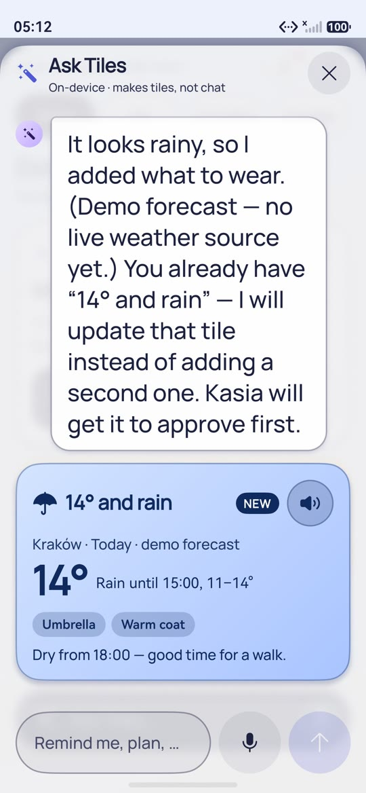
  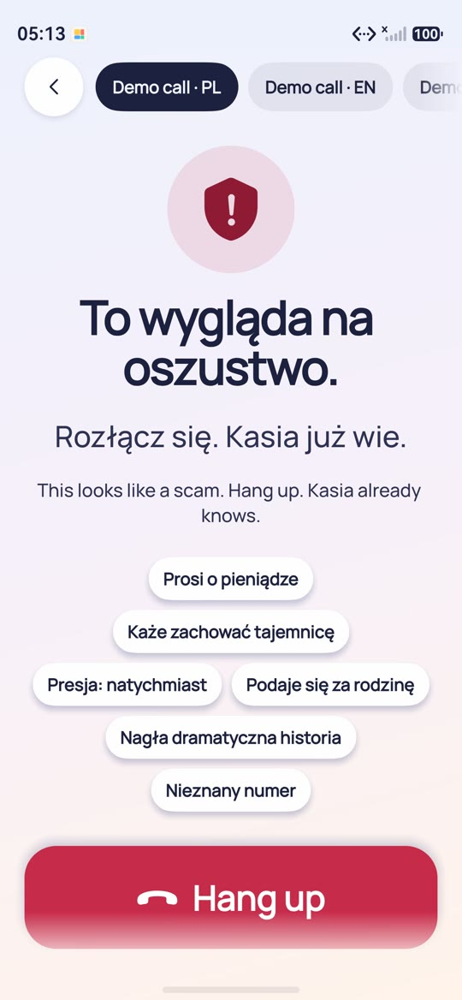
</p>
<p align="center"><sub>Onboarding · Senior (Halina) · Kid (Zosia) · Everyday (Daniel) · Ask Tiles · Guardian (demo call, simulated). Screenshots from the HarmonyOS 6.1 emulator. Demo video: <a href="docs/video/tiles-demo.mp4"><code>docs/video/tiles-demo.mp4</code></a>.</sub></p>

**Tiles is a phone home that reshapes itself around the person using it.** It is a native **HarmonyOS** app (ArkTS +
ArkUI, minimum API 20). The home screen is a grid of **big, colourful, live tiles**. Each tile is a small,
actionable card: "Pills 8:00, tap when taken", "Call Kasia", "14° and rain, take the umbrella", "Homework: 3 of 5
done", "Dinner Fri 19:30 at Veganda, vote". An assistant bar (**Ask Tiles…**) turns a plain-language request into
new tiles. This is **generative UI**: the assistant returns a structured `TileSpec` (layout, colour, content blocks,
actions), and the app renders it natively.

The app **adapts to each person**. A profile switcher regenerates the home for a senior, a child, a person with low
vision, or an everyday user. Tiles also learns from use, for example "11 missed taps today, make text 40% bigger?".
For seniors and kids, a **caregiver or parent approves** every change and every tile the assistant proposes. A
**Guardian** tile shields seniors from scam calls with explainable red flags.

Submission for **HackYeah 2026, Huawei partner task "Imagine What's Next"**. Lead theme: **Human-Centric
Technology** (accessibility, seniors, kids, digital wellbeing), with **Intelligent Experiences** (generative UI and
on-device personalisation). Organizers' repository: <https://github.com/onirodeveloper/hackyeah2026-challenge>.
Product spec: [`docs/TILES_SPEC.md`](docs/TILES_SPEC.md).

| | |
|---|---|
| Language / UI | ArkTS + ArkUI (declarative, state management V1, ArkTS strict mode) |
| App model | Stage model (`UIAbility` + `FormExtensionAbility`) |
| SDK levels (`build-profile.json5`) | compatible (minimum) **API 20** `6.0.0(20)`, compile **API 24** `6.1.1(24)`, target **API 24** `6.1.1(24)` |
| Runtime | `runtimeOS: "HarmonyOS"`, device type `phone` |
| Deliverable | `.hap` (module `entry`) |
| Bundle name | `com.hackyeah.tiles` |
| Build system | hvigor + ohpm (`devecocli`), or the OpenHarmony SDK + `oniro-app` for the no-Huawei-ID signed build |

<!-- VERIFIED:BEGIN -->
> **Verification status (4 Oct 2026, ~07:00):** the parts were checked one by one by the build fleet on the DevEco
> **HarmonyOS 6.1.1 phone emulator (API 24)**. The `.hap` was built with the OpenHarmony SDK and signed with its debug
> keystore, with no Huawei ID (section 4). Seen working:
> - install and launch of `com.hackyeah.tiles` and the notification permission dialog
> - the four profile homes
> - the TileSpec renderer (all 10 block kinds, high contrast, text scale, dark mode)
> - Ask Tiles generating a dinner plan with votes, and pill tiles sent to Kasia for approval
> - the Guardian demo call and SMS with a caregiver alert
> - notifications in the shade
> - the system dial screen
> - all three home-screen widgets with live data
>
> Some screens (assistant sheet, Guardian) were first checked in agent test builds that opened the screen directly,
> before the home shell wired them in. Limitations are listed in the capability table: reminders run only while the
> app is open, read-aloud goes through the screen reader, and haptics cannot be felt on the emulator. Screenshots:
> [section Screenshots](#screenshots).
<!-- VERIFIED:END -->

> **Earlier concept (superseded).** Until the morning of 4 October this app was **Aegis Pocket**, an approvals
> companion for AI agents. It was replaced by Tiles. Its material is kept for transparency, but it is **not** the
> submission: [`docs/HACKTRIBE_POCKET.md`](docs/HACKTRIBE_POCKET.md), [`docs/video/`](docs/video/)
> (`aegis-pocket-demo-60s.mp4`, `cover.png`, captions), `docs/screenshots/0*.jpeg`,
> `docs/deck/AegisPocket_HackYeah2026_Huawei.pdf` and `scripts/pocket-video/`. The Tiles material is in
> [`docs/HACKTRIBE_TILES.md`](docs/HACKTRIBE_TILES.md), `docs/deck/Tiles_HackYeah2026_Huawei.pdf`, `docs/cover.png`
> and `docs/screenshots/tiles/`.

## What it does (demo flow)

1. **Onboarding: "Who is this phone for?"** Pick a profile: Senior (Halina, 78), Kid (Zosia, 8), Low vision
   (Michał) or Everyday (Daniel, 29). The home regenerates for that person: tile sizes, colours, text scale,
   contrast, read-aloud and the seed tiles all change. You can switch again later in Settings.
2. **Home grid.** A greeting, the date and a profile chip. Below them is the adaptive grid of tiles (1x1, 2x1 and
   2x2). Tap a tile to act on it ("Taken", call, vote) or open its detail. Long-press a tile to reorder or remove
   it. A suggestion banner shows when Tiles has noticed something.
3. **Ask Tiles.** Type a request or tap a quick chip for the profile, for example "Remind me to take Euthyrox at 8
   every morning" or "Dinner Friday with Ola and Kuba, vegan, near Kazimierz, under 80 zł". While "Tiles is
   making…" shows, the request is turned into 1-3 tiles, a short reply and follow-up chips. Then:
   - Everyday and low-vision profiles: **Add** puts the tiles on the home.
   - Senior and kid profiles: **Ask Kasia / Mum to approve** puts them in the approvals queue.
4. **Caregiver** ("Kasia's phone", a simulation on the same device): pending assistant tiles and adaptation
   suggestions, each with **Approve / Decline**. Approved changes appear on the home.
5. **Guardian** (senior): a labelled **Demo call** transcript is checked for red flags such as "asks for money" or
   "pressure: right now". The screen then shows one calm instruction: "This looks like a scam. Hang up. Kasia
   already knows."
6. **Platform hooks:** pill notifications and caregiver alerts, home-screen widgets, calls handed to the system
   dial screen, read-aloud and haptics (next section, with the status of each).

## Profiles (ICPs)

| Profile | Home | Assistant proposals |
|---|---|---|
| **Senior: Halina, 78** | Very large 2x1 / 2x2 tiles, high contrast, text scale 1.4, read-aloud on tap. Tiles: pills, "Call Kasia", weather with what to wear, Guardian scam shield, SOS | Wait for caregiver Kasia |
| **Kid: Zosia, 8** | Playful bright palette. Tiles: homework checklist, focus timer, "Call Mum", a screen-time meter, "today's adventure" | Wait for a parent |
| **Low vision / motor: Michał** | Voice-first, extra-large targets, fewer tiles, two-column grid, high contrast, everything read aloud | Added directly |
| **Everyday: Daniel, 29** | Dense, colourful grid: plans with friends (options + vote buttons), focus timer, commute | Added directly |

All people, contacts, places and numbers are fictional. Demo phone numbers use the 555-01xx range.

## Generative UI: the TileSpec contract

The assistant does not return prose for the person to read. It returns data in a fixed schema
(`entry/src/main/ets/tiles/model/Tile.ets`, specified in [`docs/TILES_SPEC.md`](docs/TILES_SPEC.md)):

- `TileSpec`: `type` (pills, call, weather, guardian, plan, timer, homework, screentime, reminder, note, sos,
  commute, adventure, custom), `title`, `subtitle`, `icon`, `color` (palette key: sun, coral, sky, mint, grape,
  peach, leaf, ink), `size` (1x1, 2x1, 2x2), `blocks`, `source` (seed, assistant, adaptation), `speakText`.
- `TileBlock`: `kind` is one of text, big, list, checklist, progress, buttons, timer, chips, alert or weather.
- `TileAction`: `kind` is one of call, remind, speak, open, done, vote, navigate, sos or dismiss.
- `ComposeResult` is the assistant's answer: `reply`, `tiles`, `needsApproval`, `followUps`.
- `Profile` holds per-person settings: text scale, high contrast, read-aloud, columns and caregiver.
- `Suggestion` is an adaptation proposal awaiting approval, such as `textScale:1.4`, `readAloud:on` or
  `addTile:<json>`.

One renderer (`tiles/components/TileView.ets` plus `components/blocks/*`) draws every tile from that data. The
**generator is pluggable**. Today it is an **on-device, deterministic intent planner** (`tiles/ai/`). It uses
keyword and slot extraction for English and Polish (time, day, person, place, food, budget, medicine, homework
subject) and maps the result to tile templates per profile. It contains no machine-learning model and makes no
network call. The same JSON could later come from a language model behind guardrails (for example the team's
separate Aegis gateway). That would be a future mode and is not claimed here.

## Platform capabilities used

Paths are relative to `entry/src/main/ets/` unless they start with `entry/` or `resources/`.
**Status:** ✅ *verified on emulator* means a build-fleet agent saw it work on the DevEco HarmonyOS 6.1.1 (API 24)
emulator (screenshots, `hilog`). ⚠️ marks a limitation. *Implemented* means it is in the code and builds, but has not
been shown on a target.

<!-- CAPS:BEGIN -->
| Capability | Kit / API | Where | Status |
|---|---|---|---|
| **Notifications**: pill and reminder notifications, caregiver alerts ("Halina took her 8:00 pills", "Guardian: … may be on a scam call"), permission dialog, tap opens the tile | Notification Kit `notificationManager.requestEnableNotification`, `publish`; Ability Kit `wantAgent` (want parameter `tileId`) | `tiles/platform/TileNotifications.ets`, `entryability/EntryAbility.ets` | ✅ verified on emulator (permission dialog, notifications in the shade) |
| **Home-screen widgets**: Next up (2x2), My tiles (2x4), Big buttons (4x4, senior), live data from the app, tap opens Tiles | Form Kit `FormExtensionAbility`, `formProvider.updateForm`, `formBindingData`, ArkTS cards with `postCardAction` router | `formability/PostureFormAbility.ets` (class `TilesFormAbility`), `widget/pages/*Card.ets`, `platform/WidgetBridge.ets`, `resources/base/profile/form_config.json` | ✅ verified on emulator (all three added to the home screen, live data, update after an in-app change) |
| **Calls**: "Call Kasia", "Call Mum", widget Call button | Telephony Kit `call.makeCall` (dial screen with the number filled in, user presses Call), fallback `Want` `ohos.want.action.dial` + `tel:` | `tiles/platform/Calls.ets` | ✅ verified on emulator (system dial screen with a fictional number) |
| **Guardian scam shield**: explainable EN/PL red flags, risk meter, calm instruction, caregiver alert with a redacted preview | On-device rules + Notification Kit; redaction with the on-device `Redactor` | `tiles/ai/Guardian.ets`, `tiles/views/GuardianView.ets`, `redaction/Redactor.ets` | ✅ verified on emulator (demo call PL 97 % scam + caregiver notification, EN call → hang up, SMS, safe message) |
| **Generative UI assistant**: request → 1-3 native tiles; approval queue for senior / kid | On-device intent planner (no Kit, no network) feeding the `TileSpec` renderer | `tiles/ai/Intents.ets`, `tiles/ai/Composer.ets`, `tiles/views/AssistantSheet.ets`, `tiles/components/*` | ✅ verified on emulator (dinner plan with votes added; senior pills sent for approval) |
| **Scheduled reminders** | Background Tasks Kit `reminderAgentManager.publishReminder` | `tiles/platform/Reminders.ets` | ⚠️ implemented, but the system rejects it on the emulator with **1700002**: ordinary apps without the AppGallery agent-reminder entitlement have a limit of 0. Fallback: an in-app timer + Notification Kit, which fires **only while Tiles is running** (verified after 15 s). No background reminders are claimed |
| **Read-aloud** | Accessibility Kit `sendAccessibilityEvent` (`announceForAccessibility`) | `tiles/platform/Speech.ets` | ⚠️ Core Speech Kit TTS is not in the OpenHarmony SDK we build with. Read-aloud is spoken by the **system screen reader when it is on**; otherwise a visible "Speaking…" state and a labelled toast appear. Spoken output not verified |
| **Haptics** on every tile action | Sensor Service Kit `vibrator.startVibration` | `tiles/platform/TileHaptics.ets` | ⚠️ implemented; not verifiable on the emulator (no vibrator, 14600101, silently skipped) |
| **Background widget refresh** (recompute "Next up" while the app is closed) | Background Tasks Kit `workScheduler`, `WorkSchedulerExtensionAbility` | `platform/BackgroundRefresh.ets`, `workscheduler/RefreshWorkAbility.ets` | implemented, not verified (system-scheduled) |
| **Persistence**: tiles per profile, profile, pending approvals, suggestions, widget snapshot | ArkData Preferences | `tiles/data/TileStore.ets`, `platform/WidgetBridge.ets` | ✅ verified on emulator (state reaches the widgets, e.g. a vote shown on My tiles) |
| **Accessibility + theming**: text scale 1.4, high-contrast palette, 64 vp tap targets for seniors, light / dark mode, reduced motion, spring animations | ArkUI `fp` units, `accessibilityText`, `animateTo` / spring curves, `applicationContext.setColorMode` | `tiles/theme/TilesTheme.ets`, `tiles/components/*`, `tiles/views/*` | ✅ verified on emulator (senior high contrast, text scale, dark mode); screen-reader reading not verified |
<!-- CAPS:END -->

Permissions: `ohos.permission.VIBRATE` (system_grant) and `ohos.permission.PUBLISH_AGENT_REMINDER` (agent-powered
reminders; the reminder quota itself needs an AppGallery entitlement, see the table). Notifications are enabled
through the system dialog. Calls open the dial screen with the number filled
in, and the user presses Call, so no `CALL_PHONE` permission is needed. No location, contacts, microphone or camera
permission is requested. Only ordinary-app APIs are used, with no system-app privileges.

## 1. Repository layout

```
.
├── AppScope/                       # App-wide config: app.json5 (bundleName com.hackyeah.tiles, label, icon) + resources
├── entry/                          # The single HAP module (type: entry)
│   └── src/main/
│       ├── module.json5            # Abilities, form extension, permissions
│       ├── ets/entryability/       # EntryAbility: init store + platform services, deep links (onNewWant)
│       ├── ets/pages/Index.ets     # Tiles shell (home, sheets, navigation)
│       ├── ets/tiles/model/        # Tile.ets: TileSpec, TileBlock, TileAction, Profile, Suggestion, ComposeResult
│       ├── ets/tiles/data/         # TileStore (AppStorage + Preferences), seed tiles per profile
│       ├── ets/tiles/ai/           # On-device generator (intent planner), adaptation, Guardian red flags
│       ├── ets/tiles/components/   # TileView + block components (generic TileSpec renderer)
│       ├── ets/tiles/views/        # Home, tile detail, assistant sheet, onboarding, caregiver, Guardian, settings
│       ├── ets/tiles/platform/     # Reminders, notifications, read-aloud, calls, haptics, action dispatcher
│       ├── ets/tiles/theme/        # Palette, per-profile theme, high contrast, dark mode
│       ├── ets/formability/        # FormExtensionAbility for the home-screen widgets
│       ├── ets/widget/pages/       # Widget cards: Next up (2x2), My tiles (2x4), Big buttons (4x4)
│       └── resources/              # Strings, colors, profile/form_config.json, profile/main_pages.json
├── build-profile.json5             # SDK versions, products, (empty) signing configs, modules
├── scripts/build-ohos-signed.sh    # No-Huawei-ID build: OpenHarmony SDK + its debug keystore -> signed .hap
├── docs/TILES_SPEC.md              # Product + data-model spec (source of truth)
├── docs/HACKTRIBE_TILES.md         # Submission text and 60-second video script
├── docs/deck/                      # 10-slide PDF deck + cover (build.sh)
├── AGENTS.md, CLAUDE.md, GEMINI.md # Agent guidance (organizers' Hackathon Template)
├── AI_WORKFLOW.md                  # AI tools, prompts, work log, validation
├── hackathon-resources/            # Organizers' bundled reference
├── aegis/                          # Separate submission (Goldman Sachs): the Aegis gateway
└── README.md
```

Some folders under `entry/src/main/ets/` (`views/`, `components/`, `data/`, `redaction/`, `workscheduler/`, …) and
`entry/src/test/` may still hold code from the superseded Aegis Pocket concept until the cleanup lands. Tiles does
not import it, except the generic Preferences and haptics helpers in `platform/`.

## 2. Prerequisites

| Tool | Version | Notes |
|---|---|---|
| macOS (Apple Silicon) | 27 | Development machine. The DevEco Studio emulator needs Apple Silicon |
| DevEco Studio | 6.1.x (data directory `DevEcoStudio6.1`) | Bundles the HarmonyOS SDK, hvigor, ohpm, hdc and the emulator. Install into `/Applications` |
| HarmonyOS SDK | 6.1.1(24) | Bundled with DevEco Studio 6.1.1 (`Contents/sdk/default`); used as compile/target SDK, minimum API 20 |
| Node.js | 22 or later (tested with 24.10) | Required by `devecocli`. Keep your own Node first on `PATH`, not DevEco's bundled `tools/node` |
| Python 3 | any 3.x | Some agent skills call the `python` command |
| Java | any recent JDK on `PATH` | hvigor starts a small Java helper daemon during builds |
| Git | any recent | |

> Local machine-specific toolchain files go in `.toolchain/`, which is git-ignored.

## 3. Setup

The organizers' automated installer ([`INSTALLATION_PROMPT.md`](https://github.com/onirodeveloper/hackyeah2026-challenge/blob/main/INSTALLATION_PROMPT.md))
supports Windows only. On macOS their README and FAQ say to do the same steps by hand. The steps below are that
macOS path. The two scripts in `scripts/` automate the manual parts. Neither script uses sudo.

```bash
git clone https://github.com/JustAnotherDevv/tiles-hackyeah-2026.git
cd tiles-hackyeah-2026
# The organizers' repository provides the skills, the DevEco CLI patches and the templates:
git clone --depth 1 https://github.com/onirodeveloper/hackyeah2026-challenge /tmp/hy-challenge
```

### 3.1 DevEco Studio and the emulator

1. **Install DevEco Studio 6.1** into `/Applications`. See the
   [Oniro DevEco Studio installation guide](https://docs.oniroproject.org/application-development/environment-setup-guide/deveco-studio/installation/).
2. **First launch.** Start DevEco Studio once, finish the first-launch setup (including the SDK download), then
   quit it (Cmd+Q). This step creates `~/Library/Application Support/Huawei/DevEcoStudio6.1/options/country.region.xml`.
3. **Switch the region to China.** Outside China, Device Manager only offers smart-watch emulators. With the
   region set to CN it also offers phone, tablet, 2-in-1 and TV emulators.
   ```bash
   scripts/set-deveco-region-cn.sh --dry-run   # shows the change
   scripts/set-deveco-region-cn.sh             # backs up the file, sets <countryregion name="CN"/>
   ```
   The script reads `dataDirectoryName` from the app's `product-info.json`. It refuses to run while DevEco Studio is
   running and never creates the file. This follows the organizers' [FAQ](https://github.com/onirodeveloper/hackyeah2026-challenge/blob/main/FAQ.md#how-do-i-switch-the-deveco-studio-region-to-china-manually).
4. **Create and start an emulator** (GUI only; the agent cannot do this). Start DevEco Studio, open Device Manager,
   create a **Phone** device, download its system image (newest available, API 24; several GB) and start it. With
   8 GB RAM, close other heavy apps first. See the [Oniro emulator guide](https://docs.oniroproject.org/application-development/environment-setup-guide/deveco-studio/emulator/).
5. *(Optional)* **Install the organizers' project templates** (`Hackathon Template`, `Conductor Hackathon Template`)
   into DevEco's Create Project wizard. This repository already contains the Hackathon Template files, so you only
   need the templates to create new projects.
   ```bash
   scripts/install-deveco-templates.sh --source /tmp/hy-challenge --dry-run
   scripts/install-deveco-templates.sh --source /tmp/hy-challenge
   ```
   Target directory: `<DevEco Studio>.app/Contents/plugins/openharmony/lib/templates/project`. This is the macOS
   equivalent of the organizers' Windows path `<DevEcoStudioRoot>\plugins\openharmony\lib\templates\project`.
   The script does not overwrite or merge an existing template that differs. If macOS reports
   "Operation not permitted", allow your terminal under System Settings > Privacy & Security > App Management.
   Restart DevEco Studio afterwards.
6. **Open this project.** In DevEco Studio choose File > Open and select this folder. Let it sync and accept the SDK
   prompts. DevEco creates `local.properties` (git-ignored), which points at your SDK. Then restore dependencies:
   ```bash
   ohpm install            # restores oh_modules/ (hypium, hamock)
   ```
   (`devecocli build` also runs `ohpm install` for you.) Verified paths with DevEco Studio 6.1.1: DevEco puts its tools under
   `<DevEco Studio>.app/Contents/tools/{ohpm,hvigor}/bin` and `hdc` under
   `<DevEco Studio>.app/Contents/sdk/default/openharmony/toolchains`. You can add these directories to `PATH`, but
   do not add `Contents/tools/node`.

### 3.2 Agent tooling (Claude Code)

We use **Claude Code** (model Claude Opus 5.5) with **parallel sub-agents** (see [AI_WORKFLOW.md](AI_WORKFLOW.md)).
The tooling is installed **for this project**, not in the user-level agent configuration.

**Agent skills.** The organizers' nine skills are copied unmodified into `.claude/skills/`, where Claude Code loads
project skills. The folder is git-ignored because it holds about 26 MB of third-party content. To restore it:

```bash
mkdir -p .claude/skills && cp -R /tmp/hy-challenge/skills/* .claude/skills/
```

| Skill | Purpose |
|---|---|
| `ohos-app-scaffold` | Creates a new, untouched project skeleton and stops |
| `ohos-app-dev` | Inner dev loop for an existing app: lint, build, run, logs, UI checks |
| `ohos-system-app-dev` | Privilege preflight and dev loop for apps that may need system-app identity |
| `ohos-system-dev` | Platform components built inside the OpenHarmony source tree |
| `conductor-dev` | Conductor orchestration. Not used with this template (see `AGENTS.md`) |
| `hmos-arkts-knowledge-retriever` | Grounded ArkTS and API references |
| `hmos-arkui-scenario-development` | Scenario-based ArkUI development (REQ, DEV, FIX, VAL) |
| `hmos-arkui-develop-skill` | ArkUI pages, components, layout and state |
| `hmos-arkui-mvvm-pattern` | MVVM layering and refactoring |

**DevEco CLI.** Install `@deveco/deveco-cli` **exactly 1.3.4**, because the organizers' patches are verified only
against that version. The package pins its companion `@deveco/deveco-cli-common` to 1.3.4. Then apply the patches.
They fix the linter wording and disable a Windows memory sampler.

```bash
npm install -g @deveco/deveco-cli@1.3.4
node /tmp/hy-challenge/scripts/apply-devecocli-patches.mjs   # "Applied DevEco CLI 1.3.4 patches at ..."
node /tmp/hy-challenge/scripts/apply-devecocli-patches.mjs   # must say "patches are already applied"
devecocli -V                                                 # 1.3.4
```

`devecocli` is installed into `$(npm config get prefix)/bin`, which must be on `PATH`. To opt out of the CLI's
telemetry, set `export DEVECO_CLI_DISABLE_TELEMETRY=1`.

**DevEco CLI skill** (after DevEco Studio is installed, because the CLI refuses to run without it). Install it into
this project only:

```bash
devecocli init --skill --agent claude-code --project .   # writes .claude/skills/deveco-cli/SKILL.md
```

Without `--agent`/`--project`, `init` writes into the global configuration of every agent it detects.

Restart Claude Code after installing skills so that it loads them.


## 4. Build a signed `.hap` without a Huawei ID (recommended)

A `.hap` needs a debug signature before it installs on the emulator or a device. An unsigned `.hap` builds but
does not install. Signing a HarmonyOS project in DevEco requires a Huawei ID with real-name verification. We could
not complete that, so the `.hap` we test and ship is built against the **OpenHarmony 6.1 public SDK (API 23,
minimum API 20)** and signed with that SDK's **built-in debug keystore**. No Huawei ID is involved. The DevEco
HarmonyOS 6.1.1 phone emulator accepts this build.

```bash
source .toolchain/env.sh             # no-login OpenHarmony SDK + command-line tools + oniro-app (git-ignored; see .toolchain/README.md)
scripts/build-ohos-signed.sh         # -> release/tiles-debug-signed.hap (file name kept from the earlier concept; it contains Tiles)
```

The script copies the sources to `.toolchain/oniro-build/aegis-pocket/` (git-ignored) and changes only that copy:
`runtimeOS: "OpenHarmony"`, compile/target API 23, minimum API 20, `deviceTypes: ["default"]` and no dev
dependencies. Then `oniro-app sign` writes debug keys and `signingConfigs` into the copy (this needs `java`), and
`oniro-app build --no-deps` builds it. The repository's own `build-profile.json5` stays a HarmonyOS project with
`signingConfigs: []`. No keys, certificates, profiles or passwords are committed.

`.toolchain/` is set up by following `.toolchain/README.md` (OpenHarmony 6.1 SDK, hvigor CLI, `oniro-app`). The
same steps are described in [`docs/ONIRO_RUN.md`](docs/ONIRO_RUN.md).

### 4.1 With a Huawei ID (DevEco signing)

1. DevEco Studio > File > Project Structure > Signing Configs > tick **Automatically generate signature** (this
   needs a Huawei ID sign-in).
2. DevEco writes the keys and certificates to `~/.ohos/config/` (outside the repo). It also fills
   `app.signingConfigs` in `build-profile.json5` with **absolute local paths and encrypted passwords**.
3. **Do not commit that block.** Before committing, check `git diff build-profile.json5` and revert
   `signingConfigs` to `[]`. `*.p12`, `*.cer`, `*.p7b` and similar files are git-ignored.

## 5. Build with DevEco (HarmonyOS SDK)

```bash
export DEVECO_CLI_DISABLE_TELEMETRY=1
devecocli build --modules entry --build-mode debug     # runs ohpm install + hvigor; exit code 0 = success
```

Output: `entry/build/default/outputs/default/entry-default-unsigned.hap` (no signing configured), or
`entry-default-signed.hap` after DevEco signing (section 4.1).

Without `devecocli`, call DevEco's bundled hvigor directly:

```bash
DEVECO=/Applications/DevEco-Studio.app/Contents
"$DEVECO/tools/node/bin/node" "$DEVECO/tools/hvigor/bin/hvigorw.js" \
  --mode module -p module=entry@default -p product=default -p buildMode=debug assembleHap
"$DEVECO/tools/node/bin/node" "$DEVECO/tools/hvigor/bin/hvigorw.js" --stop-daemon   # free RAM afterwards
```

## 6. Start the emulator

Create a **Phone** emulator once in DevEco Device Manager (section 3.1; we use `AegisPhone`, HarmonyOS 6.1.1(24), 2 GB
RAM). Then start it from DevEco, or from the command line:

```bash
/Applications/DevEco-Studio.app/Contents/tools/emulator/Emulator -start AegisPhone
HDC=/Applications/DevEco-Studio.app/Contents/sdk/default/openharmony/toolchains/hdc
$HDC list targets                                  # e.g. 127.0.0.1:5555 must be listed
```

## 7. Install and launch

```bash
$HDC install -r release/tiles-debug-signed.hap          # the no-Huawei-ID build from section 4
# or, after DevEco signing (section 4.1):
$HDC install -r entry/build/default/outputs/default/entry-default-signed.hap
$HDC shell aa start -a EntryAbility -b com.hackyeah.tiles
$HDC hilog | grep -i tiles                                     # app logs
```

If the emulator still has the earlier Aegis Pocket build, it has a different bundle name
(`com.hackyeah.aegispocket`) and can stay installed. Remove it with `$HDC uninstall com.hackyeah.aegispocket` if you
like. If an install fails with a signature mismatch for `com.hackyeah.tiles`, run
`$HDC uninstall com.hackyeah.tiles` first.

You can also tap **Tiles** on the launcher. The app asks to allow notifications (reminders). To add a widget,
long-press the home screen, open **Service widgets**, choose **Tiles**, then **Next up** (2x2), **My tiles** (2x4)
or **Big buttons** (4x4).

Screenshot from the command line:

```bash
$HDC shell snapshot_display -f /data/local/tmp/tiles.jpeg && $HDC file recv /data/local/tmp/tiles.jpeg .
```

## 8. Tests

Tiles has **no automated tests yet**. This was a time-boxed choice during the pivot. Validation is the build
(ArkTS strict mode) plus on-device checks on the emulator with screenshots and `uitest dumpLayout`. The local unit
tests in `entry/src/test/` belong to the superseded Aegis Pocket code.

## 9. Architecture

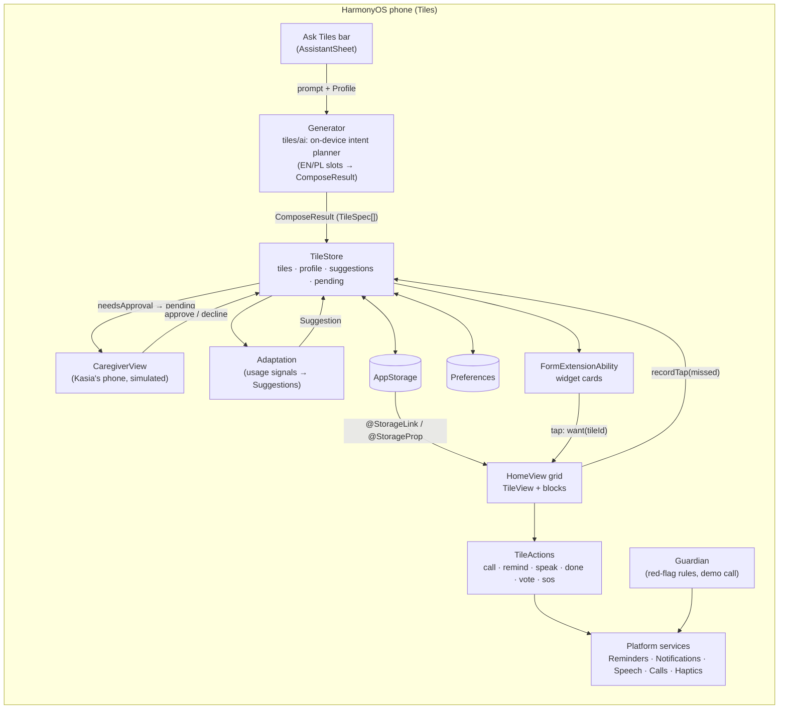

- **One contract.** The generator, the adaptation engine and the seed tiles all produce `TileSpec`s. The renderer
  consumes only `TileSpec`s, so a new tile type needs no new screen, only a template.
- **State.** `TileStore` is a singleton. It publishes its lists to `AppStorage` under the keys `tiles.list`,
  `tiles.profile`, `tiles.suggestions` and `tiles.pending`, and persists them with ArkData Preferences. Its API:
  `addTiles`, `removeTile`, `moveTile`, `propose`, `approvePending`, `declinePending`, `decideSuggestion` and
  `recordTap`.
- **Approval gate.** For profiles with a caregiver (senior, kid), `propose()` puts assistant tiles in
  `tiles.pending`. Only `approvePending()` adds them to the home. Adaptations work the same way through
  `Suggestion`s.
- **Actions.** `TileActions` dispatches a tile's `TileAction.kind` to the platform layer:
  - `remind`: `reminderAgentManager`, with an in-app timer + Notification Kit fallback while the app runs
  - `call`: Telephony Kit dial screen, or a `Want` to the dialer
  - `speak`: read-aloud
  - `done`, `vote` and `dismiss`: store updates
  - `sos`: caregiver notification
  - every tap also triggers haptics
- **Theme.** The palette has 8 keys, each with an on-colour, plus high-contrast variants for senior and low vision.
  `Profile.textScale` and `fp` units scale the type, and the system light or dark mode is followed.

## 10. AI features

- **In the app:** the assistant is a **deterministic, rule-based generator that runs on the device**. It does
  keyword and slot extraction for English and Polish and maps the result to tile templates. The adaptation
  suggestions and the Guardian red flags are also rules over local signals. There is **no machine-learning model,
  no LLM and no network call**, and no personal data leaves the device. The UI and these docs call it an assistant
  but never claim an LLM.
- **Guardian input is simulated.** The demo call transcript is built in and labelled "Demo call". The app does not
  listen to real calls or read real SMS.
- **Future mode, not implemented:** the same `TileSpec` JSON schema could be produced by a language model behind
  local-first guardrails (the separate Aegis gateway). Any such output would be validated against the schema before
  rendering.
- **Development** used AI tools (Claude Code with parallel sub-agents and the organizers' HarmonyOS skills). See
  [AI_WORKFLOW.md](AI_WORKFLOW.md).

## Known limitations

- The generator understands a fixed set of intents and phrasings (EN + PL). Requests it does not recognise produce
  a generic note tile and suggestion chips.
- **Read-aloud.** Core Speech Kit TTS (`@kit.CoreSpeechKit`) ships only in the HarmonyOS SDK, and the signed build
  uses the public OpenHarmony SDK. Read-aloud therefore uses an Accessibility Kit announcement, which the system
  screen reader speaks when it is on. When the screen reader is off (for example on the emulator), the app shows a
  labelled visual "speaking" state instead.
- **Reminders.** `reminderAgentManager.publishReminder` returns 1700002 for an ordinary app without the AppGallery
  agent-reminder entitlement (quota 0). Tiles then uses an in-app timer plus a Notification Kit notification, which
  fires only while the app is running. Reminders do not fire after Tiles is closed.
- The DevEco emulator cannot vibrate, so haptics are skipped. A call opens the system dial screen with the number
  filled in, and nothing is dialled until the user presses Call.
- The caregiver is simulated on the same phone ("Kasia's phone" screen). There is no second device or cloud sync
  yet. Caregiver alerts are local notifications labelled as demo.
- The Guardian scam check runs on built-in demo transcripts, not on live calls or SMS.
- Weather, plan options and places are fictional demo data.
- Phone only (`deviceTypes: ["phone"]`).

## 11. Switching runtime: HarmonyOS vs OpenHarmony

The skeleton targets the **HarmonyOS** SDK. That is DevEco's default, and the DevEco emulator on macOS only
runs HarmonyOS projects. To build against the **OpenHarmony** SDK instead (for example for an OpenHarmony or Oniro
board), change the product in `build-profile.json5`:

```json5
"compileSdkVersion": 23,
"compatibleSdkVersion": 20,
"targetSdkVersion": 23,
"runtimeOS": "OpenHarmony",
```

The OpenHarmony runtime uses integer API levels. The HarmonyOS runtime uses release labels:
`"6.0.0(20)"`, `"6.1.0(23)"`, `"6.1.1(24)"`. The Oniro emulator runs OpenHarmony 6.1 (API 23), so do not rely on
API 24 behaviour there.
Only `@ohos.*` / OpenHarmony APIs are available there. HarmonyOS-only Kits are not.

## Screenshots

<!-- SHOTS:BEGIN -->
Captured on the DevEco HarmonyOS 6.1.1 (API 24) emulator, in demo-story order. All people, numbers and plans are
fictional demo data. The Guardian call is a labelled demo sample; "Kasia's phone" / "Mum's phone" is a simulated second
device on the same emulator. Files: [`docs/screenshots/tiles/`](docs/screenshots/tiles/). The images directly in
`docs/screenshots/` show the superseded Aegis Pocket.

| | | | |
|---|---|---|---|
| 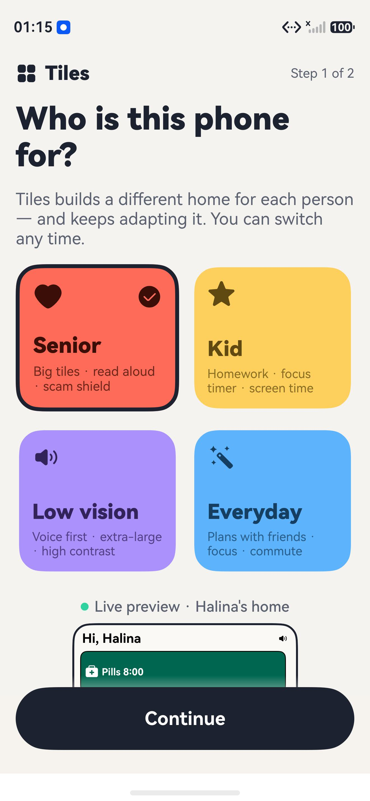 1. Onboarding: "Who is this phone for?" | 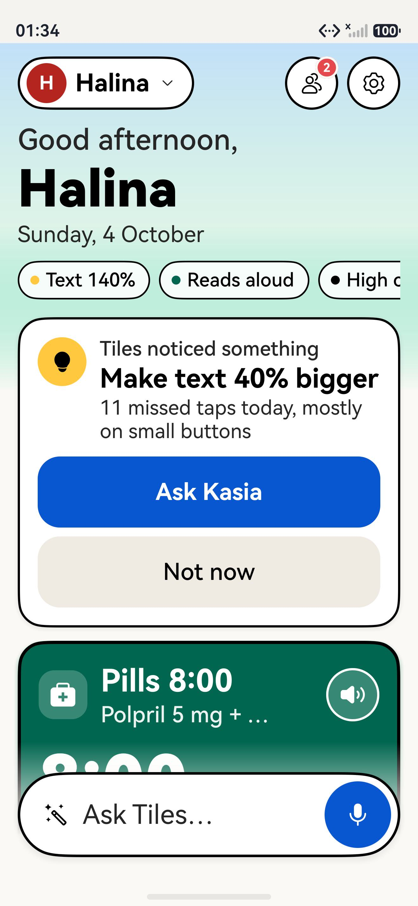 2. Halina's home: "Tiles noticed… make text bigger" | 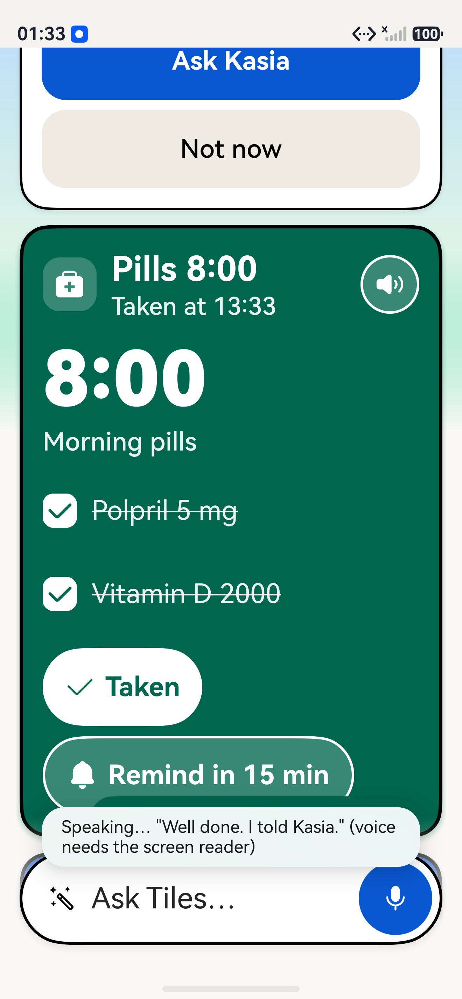 3. Pills "Taken" + read-aloud | 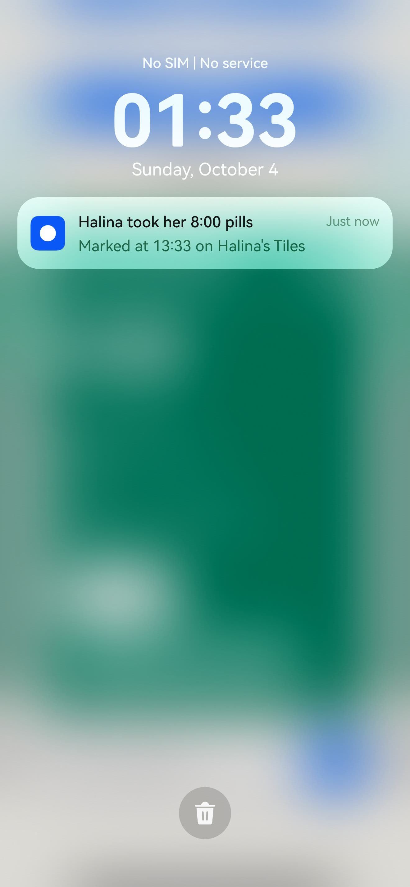 4. Notification for Kasia |
| 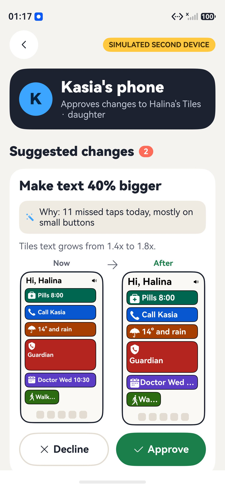 5. Kasia approves with before/after | 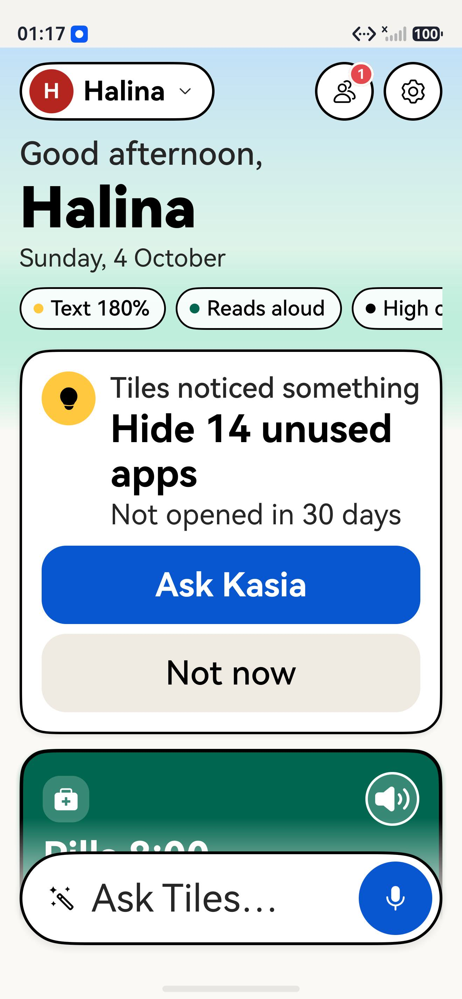 6. Home rebuilt at 180% text | 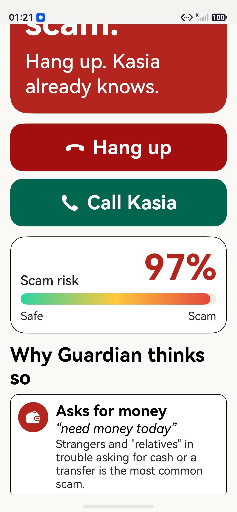 7. Guardian: demo scam call, 97% risk | 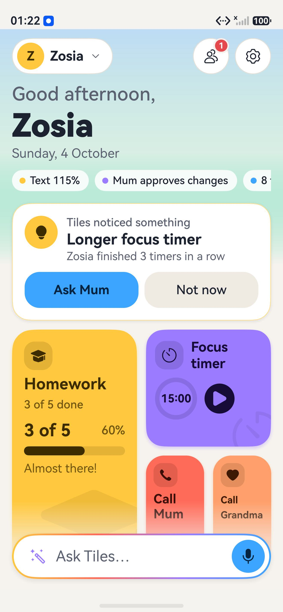 8. Switch to Zosia (kid): home regenerates |
| 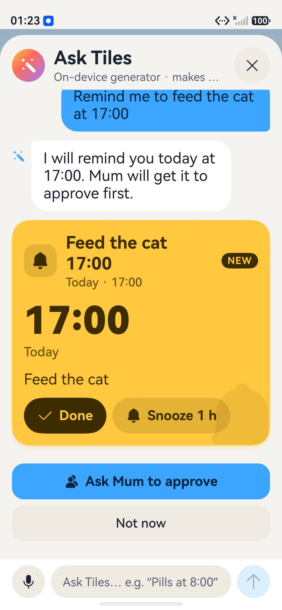 9. Ask Tiles makes a reminder tile | 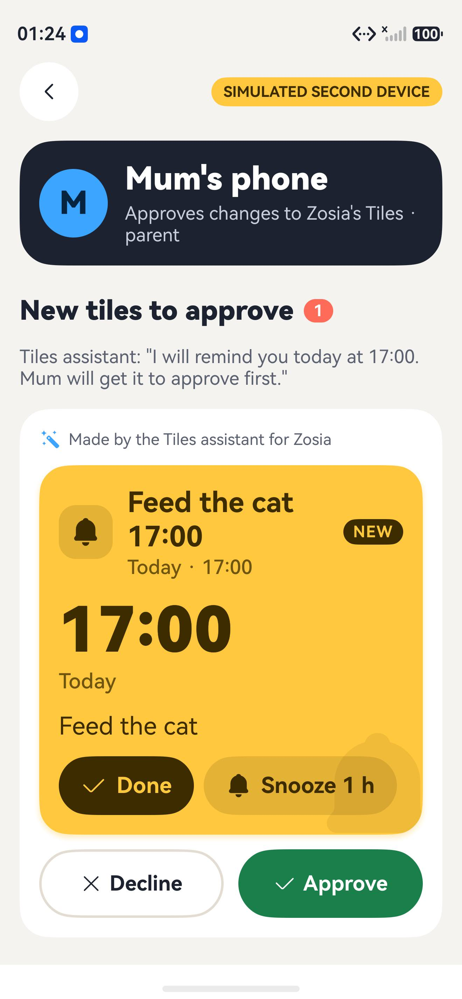 10. Mum approves the new tile | 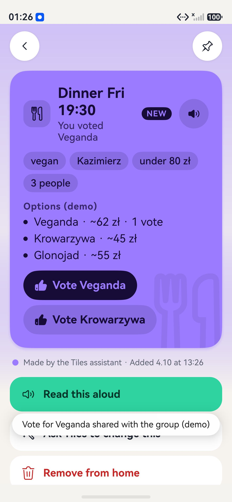 11. Daniel: dinner plan tile with votes | 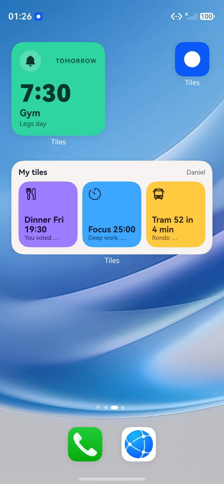 12. Home-screen widgets: Next up + My tiles |
<!-- SHOTS:END -->

## Demo (≤60 s)

The demo video is recorded on the emulator; add the link here once it is uploaded. The shot list and voice-over are
in [`docs/HACKTRIBE_TILES.md`](docs/HACKTRIBE_TILES.md#demo-video-script-60-s): onboarding, then Halina's home,
Ask Tiles generating a tile, caregiver approval, Guardian demo call, the Zosia and Daniel homes, and the widget. The
earlier `docs/video/aegis-pocket-demo-60s.mp4` shows the superseded concept.

The deck (10 slides, PDF) is `docs/deck/Tiles_HackYeah2026_Huawei.pdf`. To rebuild it with the cover
`docs/cover.png`, run `docs/deck/build.sh` (it needs Google Chrome).

---

## Huawei judging checklist

Judging weights: Originality 20, Usefulness 20, Technical execution 20, Platform use 20, Demo 10, Reproducibility 10.
They prefer a **narrow, working** solution over a broad concept.

- [ ] **Public repository**, with commit history that shows progress
- [x] **Reproducible instructions** for setup, build, install and launch (sections 2 to 7)
- [x] **Working `.hap`**, API 20+, running on the DevEco HarmonyOS 6.1.1 emulator (still to do: attach `release/*.hap` to a GitHub Release)
- [ ] **Short recorded demo** of Tiles on the emulator (link: TODO)
- [x] **Architecture description** (section 9)
- [x] **`AI_WORKFLOW.md`**: models, agents, skills, main prompts, workflow, validation, lessons learned
- [x] **AI feature docs** (section 10: on-device rule-based generator, no LLM)
- [x] Real use of **platform APIs/Kits** (table above, with status per item)
- [x] Theme fit: Human-Centric (seniors, kids, low vision, caregiver consent) + Intelligent (generative UI, adaptation)
- [ ] **No secrets in the repo**: no signing material, API keys or `signingConfigs` with local paths (check before each commit)
- [x] Simulated parts labelled (Guardian demo call, "Kasia's phone", demo contacts and data)
