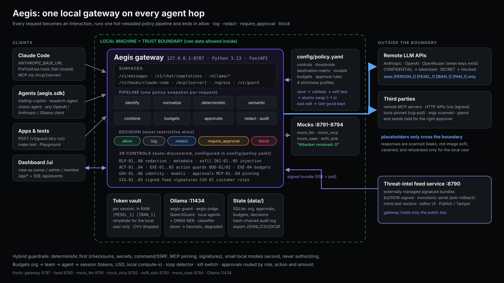
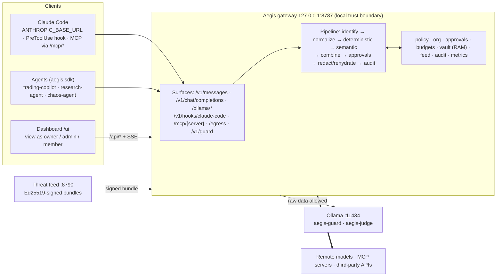

# Aegis: Local-First AI Guardrails

**One local gateway on every hop an AI agent makes** (agent ↔ model, agent ↔ MCP tool, agent ↔ third-party
HTTP, and Claude Code's own tool calls). Every request runs through one hot-reloaded policy file and
ends in `allow · log · redact · require_approval · block`.

- **Customer data never leaves in clear text.** PII, payment cards, Polish IDs (PESEL, NIP, REGON, IBAN),
  secrets and metadata become reversible placeholders (`[PESEL_1]`, `[IBAN_1]`) **on this machine**,
  before anything reaches a remote model or a third party. Real values come back only for the local user.
  CVVs are dropped, never stored.
- **Hybrid guardrails:** deterministic detectors first (checksums, secrets, command/SSRF guards, MCP tool
  pinning, signed exploit signatures), small local AI models second (injection classifier, Qwen3Guard, NER).
- **Budgets and org approvals:** org → team → agent → session budgets (tokens, USD, local compute-seconds),
  loop detection, kill switch; risky actions routed to the right role ("$50 subscription → admin").
- **Proof:** live dashboard, hash-chained audit log with OCSF export, signed threat feed, one-command test suite.

HackYeah 2026 · **Goldman Sachs: AI Control Layer** · runs fully offline on an 8 GB laptop (remote models optional).



> Judges: the 5-minute path is in **[docs/JUDGES.md](docs/JUDGES.md)**. The documented sample policy is
> **[docs/policy-reference.md](docs/policy-reference.md)** (+ [docs/samples/](docs/samples/)).

---

## Quick start (clean checkout)

Requirements: macOS or Linux, [uv](https://docs.astral.sh/uv/) (Python 3.13 is installed by uv), Node 20+
(only to build the dashboard), optional [Ollama](https://ollama.com) for the semantic controls.

```bash
make setup          # uv sync (Python 3.13 venv) + npm ci (web/)
make web            # build the dashboard into web/dist (served by the gateway at /ui)
make up             # gateway :8787 + threat feed :8790 + mocks :8791-8794, one command, status table
#   or: make gateway   # gateway only (http://127.0.0.1:8787), no feed service or mocks
open http://127.0.0.1:8787/ui
make test           # hermetic deterministic suite (no model, no network, own ports)
make claude         # optional: Claude Code routed through Aegis (demo settings profile only)
```

Without `make` (same commands the targets run):

```bash
uv sync --frozen && (cd web && npm ci && npm run build)
uv run --frozen python scripts/run_stack.py          # = make up   (--lean, --check, --dry-run, --demo)
uv run --frozen python -m aegis serve                # = make gateway
AEGIS_SEMANTIC=off uv run --frozen pytest tests \
  --ignore=tests/eval --ignore=tests/bench --ignore=tests/redteam \
  -m "not semantic and not live and not slow and not bench"   # = make test
```

Useful extras: `make demo` (stack + warm-up traffic + preflight), `make demo-preflight` (READY check and
reset between judges), `make selftest` (policy self-test), `make verify-audit`, `make eval`, `make bench`,
`make reset` (wipe `data/`, restore the golden policy), `make help` (all targets).

Optional local models (semantic controls; without them the same controls run on a deterministic heuristic
and show a `degraded` badge, never a silent pass):

```bash
make models         # verifies models/ and the Ollama tags aegis-guard (Qwen3Guard-0.6B) and aegis-judge
```

## 5-minute judge path

1. **Open the dashboard** `http://127.0.0.1:8787/ui`. Use the **view-as** switcher (top right) to act as
   `u_piotr` (member), `u_emily` / `u_marek` (admin) or `u_katarzyna` (owner). No login needed in demo mode.
2. **Playground** (`/ui/security/playground`): pick a preset or type anything. Try the PII client reply,
   "Ignore previous instructions", the Polish variant, an AWS-style key, `curl … | sh`, and "Benign but scary".
   Each result shows the action, the control that decided and what the remote side would receive.
3. **Edit the policy live:** open `config/policy.yaml` in any editor (or the Policy page,
   `/ui/governance/policy`), change `controls[id=INJ-02].threshold` from `0.80` to `0.50`, save, resend the
   **Borderline (0.70)** preset: allow → **block** (deterministic mode, `AEGIS_SEMANTIC=off`; with the injection
   classifier loaded the preset already blocks at 0.80, so try `0.80 → 0.95` instead). Break the YAML on purpose: rejected with line/col, traffic
   keeps flowing on the last good version.
4. **Approvals by role:** run `uv run --frozen python demo/agents/trading_copilot.py subscribe`. The agent's
   $50 MarketPulse subscription waits in `/ui/governance/approvals`; as `u_piotr` Approve is locked
   ("needs admin"), as `u_emily` it works and the held call proceeds.
5. **Threat feed:** open the feed editor `http://127.0.0.1:8790`, enable `AEGIS-TI-022` (EchoLeak-style image
   proxy), **Publish**; replay the Playground **EchoLeak image proxy** preset: allow → **block (SIG-01)**.
   **Tamper** → the gateway rejects the bundle and keeps enforcing the last good one.
6. **Run the suite:** `make test`. Per-control matrix in `reports/matrix.md` and `reports/selftest.html`.

Full list of one-click attacks and expected outcomes: [docs/JUDGES.md](docs/JUDGES.md).

## How the Goldman Sachs requirements map to Aegis

| Requirement | Where to see it | Key files |
|---|---|---|
| 1. Centralized policy engine (controls, thresholds, adherence %, allowed models, budgets) | Policy page, `config/policy.yaml` edits applied live | `config/policy.yaml`, `config/profiles/*.yaml`, `src/aegis/policy/` |
| 2. Hybrid guardrails (deterministic + semantic, authn/authz) | Playground, decision drawer (score vs threshold, `degraded` flag) | `src/aegis/redaction/`, `src/aegis/injection/`, `src/aegis/semantic/`, `src/aegis/actions/` |
| 3. Budget & resource governance (commercial + local, runaway loops) | Budgets page, `demo/agents/runaway.py` | `src/aegis/budgets/`, `config/pricing.yaml` |
| 4. Historical attack mitigation via an external feed | Feed editor :8790, Threats view | `feed_service/`, `src/aegis/feed/`, `config/feeds/` |
| 5. Security reporting & auditing | Overview, Live feed, Perf, audit export (JSONL / CSV / OCSF) | `src/aegis/audit/`, `src/aegis/metrics/`, `/metrics` |
| 6. Self-testing suite (positive + negative, budgets, exploits) | `make test` → `reports/` | `tests/` |
| Deliverable: architecture diagram | this page, [docs/architecture.md](docs/architecture.md) | `docs/assets/architecture.svg` |
| Deliverable: documented sample policy file (strictness levels, budget rules) | [docs/policy-reference.md](docs/policy-reference.md) | `docs/samples/policy-*.yaml` |
| Deliverable: interactive dashboard | `http://127.0.0.1:8787/ui` | `web/` |
| Deliverable: executable test suite | `make test`, `make test-live`, `make eval`, `make bench` | `tests/` |

## Architecture



Details, the request lifecycle (redaction round trip, hook deny, approval hold), the destination matrix and
the build-status table: [docs/architecture.md](docs/architecture.md).

## Try to break it

- **Playground** (`/ui/security/playground`): any text, any surface (prompt, tool input, tool output, MCP),
  any destination (`local` / `remote` / `third_party`), as any seeded agent. Dry run by default.
- **Chaos agent:** `uv run --frozen python demo/agents/chaos_agent.py` fires every control family and every
  approval kind and prints expected vs actual per step (if present in your checkout).
- **curl** against the data plane (always answers 200 with a verdict):

```bash
curl -s localhost:8787/v1/guard -H 'content-type: application/json' -H 'X-Aegis-Agent: trading-copilot@trading' \
  -d '{"interaction":{"surface":"prompt.user","destination":"remote","text":"PESEL 44051401359, IBAN PL61 1090 1014 0000 0712 1981 2874"}}'
```

More recipes: [docs/api.md](docs/api.md).

## Edit the policy live

`config/policy.yaml` is the single source of truth. Saving it runs validate → self-test → atomic swap in
about a second; a broken save is rejected and the last good version keeps serving. Every decision is
stamped with the policy version. Try (each is a one-line edit):

| Edit | Expected effect |
|---|---|
| `controls[id=INJ-02].threshold: 0.80 → 0.50` | Playground "Borderline (0.70)" flips allow → block (`AEGIS_SEMANTIC=off`; classifier loaded: `0.80 → 0.95` flips block → allow) |
| add `enabled: false` to `controls[id=DLP-02]` | AWS-style key now passes; coverage view greys out DLP-02; audited |
| `destinations.matrix.CONFIDENTIAL.remote: redact → block` | PII prompt to a remote model is blocked instead of tokenized |
| `profile: balanced → strict` | everything tightens (fail closed, lower thresholds, purchases > $1,000 blocked) |
| `budgets.limits` `team:research` `usd: 15 → 0.01` | next research call → `402 budget_exceeded` |
| `budgets.kill_switch.agents: [chaos-agent@platform]` | that agent is stopped on its next call (`429 killed`) |
| `models.denied:` add `"claude-opus-*"` | requests for Opus are blocked (GOV-02) |
| `defaults.mode: enforce → monitor` | shadow mode: decisions logged as "would block", traffic untouched |

File edits are the owner's break-glass path (applied without approval, audited as `source=file`). The same
changes made from the dashboard go through approval routing (GOV-05): a member raising a team budget by
+25 % needs an admin; more than doubling it needs the owner. See [docs/policy-reference.md](docs/policy-reference.md).

## Threat feed

A separate service (`python -m feed_service`, :8790) signs signature bundles with Ed25519; the gateway trusts
only `config/feeds/feed_pubkey.b64`, refuses rollbacks and tampered bundles, and stamps `feed_serial` on every
decision. Demo: enable `AEGIS-TI-022` in the editor and **Publish** (or
`uv run --frozen python -m feed_service publish --enable AEGIS-TI-022`); **Tamper** shows the rejection path.

## Claude Code

`make claude` starts Claude Code with a **demo settings profile only** (`demo/claude/`, never machine-wide):
model traffic through `ANTHROPIC_BASE_URL=http://127.0.0.1:8787`, tool calls through a fail-closed
`PreToolUse` hook (`scripts/aegis-hook`, exit 2 when the gateway is unreachable), MCP servers through
`/mcp/{server}`. The demo workspace `demo/claude/project/` contains a `docs/SETUP.md` with a hidden
injection for the indirect-injection scene.

## Demo cast (view-as roles)

| Id | Role | Purpose |
|---|---|---|
| `u_katarzyna` | owner | approves owner-level spend, prod writes, disabling critical controls, large budget raises |
| `u_marek` | admin (platform) | policy maintainer |
| `u_emily` | admin (trading, research) | approves the $50 subscription |
| `u_piotr` | member (trading) | sponsor of the trading copilot; can propose, cannot approve admin items |
| `u_agnieszka` | member (research) | self-approves ≤ $20 |
| `u_tomasz` | member (platform) | sponsor of `claude-code@platform` and `chaos-agent@platform` |
| `trading-copilot@trading` | agent | spends on MarketPulse ($50), reads customers, emails clients |
| `research-agent@research` | agent | local-only (Ollama); PII may stay local |
| `claude-code@platform` | agent | Claude Code via base URL + hooks + MCP proxy |
| `chaos-agent@platform` | agent | red-team / runaway loop with a $0.50/day budget |

Agent keys in `config/org.seed.yaml` are fake (`aegis_demo_…_NOT_A_SECRET`).

## Ports

| Port | Process |
|---|---|
| 8787 | Aegis gateway: data plane, `/api/*`, `/ui`, `/metrics`, `/healthz` |
| 8790 | threat-intel feed service (editor UI, Publish, Tamper) |
| 8791 · 8792 · 8793 · 8794 | mock_llm · mock_mcp · exfil_sink ("attacker received: 0") · mock_saas |
| 11434 | Ollama (optional) |

## Repository layout

```
config/            policy.yaml (the one file judges edit), profiles/, org.seed.yaml, pricing.yaml, feeds/
src/aegis/         gateway: core (pipeline), proxy, policy, redaction, egress, injection, semantic,
                   budgets, org, approvals, actions, mcp, feed, audit, metrics, integrations/claude_code, sdk
web/               React dashboard (built into web/dist, served at /ui)
feed_service/      external threat-intel feed (signs bundles)
mocks/             mock_llm, mock_mcp, exfil_sink, mock_saas
demo/              agents/, scenarios/, preflight.py, claude/ (Claude Code profile + demo workspace)
scripts/           run_stack.py (make up), aegis-hook, fetch_models.sh
tests/             unit/, e2e/, cases/ (YAML), eval/, bench/, redteam/
docs/              JUDGES, architecture, policy-reference, samples/, api, demo-script, submission/
reports/           test matrix, eval and bench results (generated)
```

## Measured results

Filled from `reports/` after the final `make test`, `make eval` and `make bench`. Numbers that were not
measured stay as placeholders; we never publish an unmeasured number.

| Metric | Value | Source |
|---|---|---|
| Test cases / failures | {{TBD: tests.total}} / {{TBD: tests.failed}} | `reports/results.json` |
| Gateway overhead p50 / p95 (deterministic path) | {{TBD: perf.overhead_p50_ms}} / {{TBD: perf.overhead_p95_ms}} ms | `reports/bench.json` |
| Injection detection rate / false-positive rate (balanced) | {{TBD: eval.detection_rate}} / {{TBD: eval.fpr}} | `reports/eval.json` |
| Redaction leak rate on validated entity types (fixture set) | {{TBD: dlp.leak_rate_validated}} | `reports/dlp-metrics.json` |
| Audit chain verify | {{TBD: audit.records}} records | `GET /api/audit/verify` |

## Known limitations (honest list)

- Single-node SQLite; the Postgres/Redis scale-out path is designed, not built.
- The LLM judge (`aegis-judge`) is escalation-only because of the 8 GB RAM budget; with Ollama down the
  semantic controls run a deterministic heuristic and report `degraded`.
- HTTPS bodies to arbitrary third-party hosts are inspected only when they go through `/egress`, the MCP
  proxy or a hooked tool call.
- Images get metadata stripping and allow/strip/block; there is no OCR.
- A2A (agent-to-agent) controls are reserved in the catalog, not implemented.
- Demo identity uses the view-as switcher (`AEGIS_DEMO_MODE=1`), not real authentication.

## Credits and licences

- NER: [`bardsai/eu-pii-anonimization-multilang`](https://huggingface.co/bardsai/eu-pii-anonimization-multilang)
  (Apache-2.0, ONNX INT8). Guard: Qwen3Guard-0.6B via Ollama (`aegis-guard`); judge: Qwen3.5-0.8B (`aegis-judge`).
- Python: FastAPI, uvicorn, httpx, pydantic, google-re2, onnxruntime, tokenizers, PyNaCl, prometheus-client,
  ruamel.yaml, rich. Web: React, Vite, Tailwind, shadcn/ui, Recharts, Monaco, framer-motion.
- Threat references: OWASP Top 10 for LLM Applications 2026, OWASP Agentic Top 10 (ASI01–ASI10),
  OWASP MCP Top 10, OWASP Agent Control Standard v0.1.0. All test data is fictional or published test data.

Team: [NAME — EMAIL] · [NAME — EMAIL] · [NAME — EMAIL] · [NAME — EMAIL]
