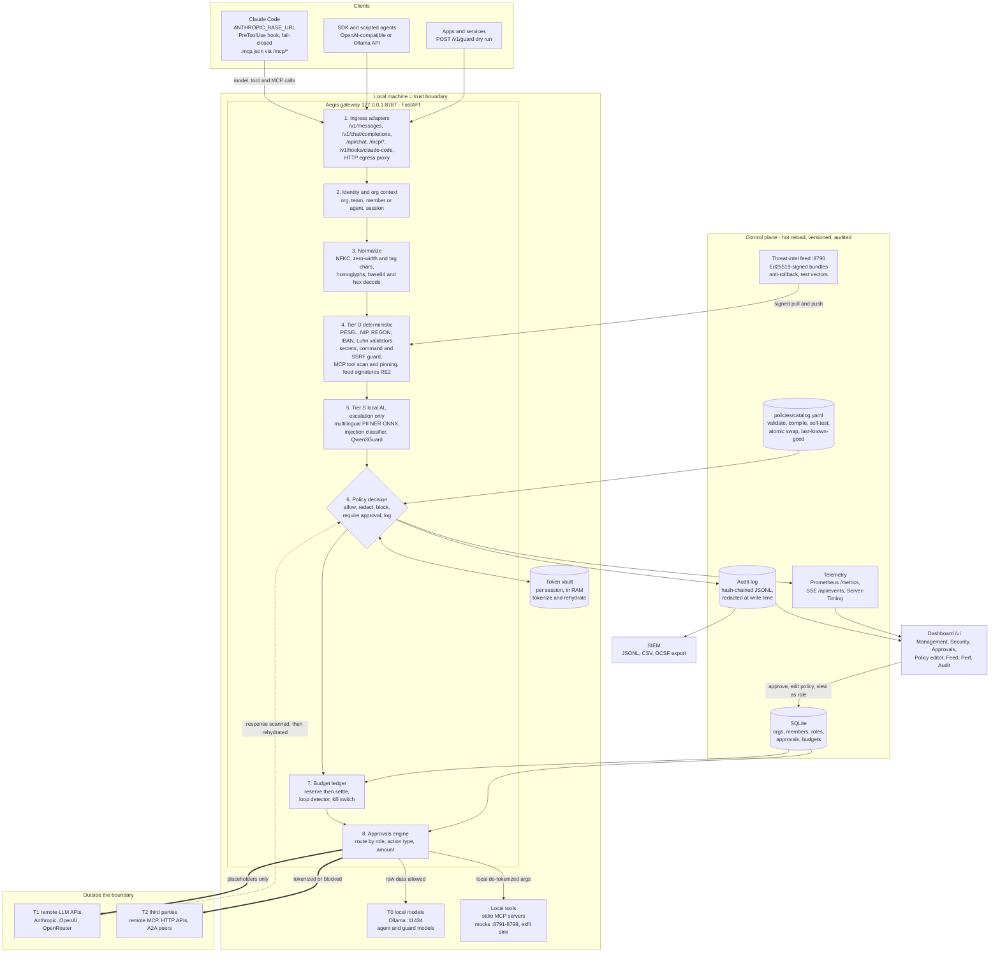
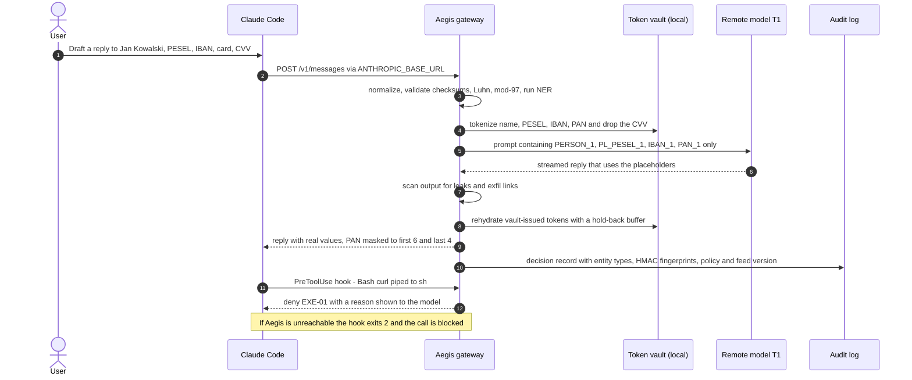
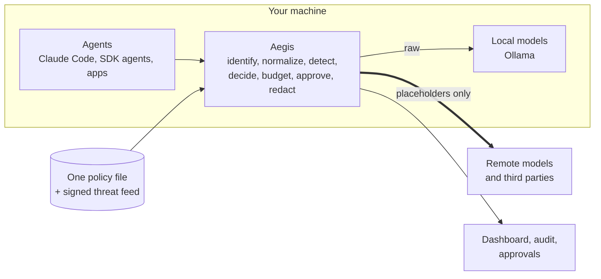

# Architecture diagram: Aegis

> **Deliverable:** the GS brief asks for "a simple architecture diagram". This file has four views:
> 1. the full component diagram (Mermaid), for the README and the judges;
> 2. the request lifecycle (Mermaid sequence), showing redaction round-trip and hook deny;
> 3. a simplified one for slide 3 and the video;
> 4. a polished ASCII version for terminals, the README fallback and `JUDGES.md`.
>
> All Mermaid blocks were render-checked with Mermaid v11 (Sat 3 Oct). To export them, paste into <https://mermaid.live>, choose Actions → PNG/SVG, and use the dark theme for slides.
> Ports and names follow `docs/BRIEF.md`: gateway 8787, feed 8790, mocks 8791–8799, Ollama 11434. Control IDs follow research `01`. **Update the "Status" column in §6 before the final submission** so the diagram never shows something that isn't built.

---

## 1. Full component diagram



**How to read it:**
- Everything inside **"Local machine = trust boundary"** sees raw data.
- Only the thick arrows (`==>`) cross the boundary, and they carry placeholders or tokenized payloads.
- The control plane is separate from the traffic path. It can be edited live, and every change is validated, versioned and audited.

---

## 2. Request lifecycle: redaction round-trip + tool-call deny



---

## 3. Simplified (slide 3, video shot 2)



---

## 4. ASCII version

Monospace, 96 columns. It renders correctly on GitHub, in terminals and in code blocks.

```text
┌───────────────────────────── CLIENTS  (agents, apps, harnesses) ─────────────────────────────┐
│ Claude Code ── ANTHROPIC_BASE_URL · PreToolUse hook (fail-closed) · .mcp.json -> /mcp/*      │
│ SDK / scripted agents ── OpenAI-compatible or Ollama APIs   Apps ── POST /v1/guard (dry run) │
└──────────────────────────────────────────────────────────────────────────────────────────────┘
         │ model calls (IP2)                 │ tool + MCP calls (IP4-IP6)          │ hook events
         ▼                                   ▼                                     ▼
╔═══════════════════════════════ LOCAL MACHINE · TRUST BOUNDARY ═══════════════════════════════╗
║ ┌───────────────── AEGIS GATEWAY  127.0.0.1:8787  (Python 3.13 · FastAPI) ─────────────────┐ ║
║ │ INGRESS   Anthropic /v1/messages · OpenAI /v1/chat/completions · Ollama /api/chat        │ ║
║ │           MCP proxy /mcp/* · Claude Code hooks /v1/hooks/claude-code · HTTP egress proxy │ ║
║ │                                                                                          │ ║
║ │ PIPELINE  1 identity+org ─> 2 normalize ─> 3 Tier D deterministic ─> 4 Tier S local AI   │ ║
║ │           ─> 5 policy decision ─> 6 budget ledger ─> 7 approvals ─> 8 vault ─> upstream  │ ║
║ │                                                                                          │ ║
║ │   Tier D  PESEL/NIP/REGON/IBAN/Luhn validators · secrets · command + SSRF guard          │ ║
║ │           MCP tool scan + rug-pull pinning · exfil-link strip · feed signatures (RE2)    │ ║
║ │   Tier S  multilingual PII NER (ONNX) · injection classifier · Qwen3Guard (escalation)   │ ║
║ │                                                                                          │ ║
║ │ DECISION  allow · redact (=ACS modify) · block (=deny) · require_approval (=ask) · log   │ ║
║ │           most restrictive wins · every decision stamped with policy + feed version      │ ║
║ └──────────────────────────────────────────────────────────────────────────────────────────┘ ║
║                                                                                              ║
║ ┌──── T0 local models ─────┐  ┌────── Token vault ───────┐  ┌─── Local tools / mocks ────┐   ║
║ │ Ollama :11434            │  │ per session, in RAM      │  │ stdio MCP servers          │   ║
║ │ agent + guard models     │  │ typed placeholders       │  │ mocks :8791-8799           │   ║
║ │ raw data allowed         │  │ rehydrate locally only   │  │ exfil sink (must be 0)     │   ║
║ └──────────────────────────┘  └──────────────────────────┘  └────────────────────────────┘   ║
╚══════════════════════════════════════════════════════════════════════════════════════════════╝
                      │ placeholders only: PII, PAN, secrets and metadata never leave in clear
                      ├───────────────────────────────────────────────┐
                      ▼                                               ▼
   ┌──────── T1 remote LLM APIs ────────┐         ┌────────── T2 third parties ──────────┐
   │ Anthropic · OpenAI · OpenRouter    │         │ remote MCP · HTTP APIs · A2A peers   │
   │ CONFIDENTIAL -> tokenized          │         │ tool args scanned before egress      │
   │ RESTRICTED -> tokenized or blocked │         │ CONFIDENTIAL -> tokenized or blocked │
   └────────────────────────────────────┘         └──────────────────────────────────────┘

CONTROL PLANE  (separate from traffic · hot-reloaded · versioned · every change audited)
┌─── Policy catalog  policies/catalog.yaml ───┐  ┌─── Threat-intel feed  :8790  (external) ────┐
│ controls · thresholds · adherence% · models │  │ historical AI exploit signatures            │
│ budgets · approval rules · strictness       │  │ Ed25519-signed, monotonic serial            │
│ validate > compile > self-test > swap       │  │ anti-rollback · inline test vectors         │
│ bad edit -> rejected, last-good kept        │  │ tampered bundle -> rejected                 │
└─────────────────────────────────────────────┘  └─────────────────────────────────────────────┘
┌──────────── Org store  (SQLite) ────────────┐  ┌───────────── Audit + telemetry ─────────────┐
│ orgs · members · roles (owner/admin/member) │  │ hash-chained JSONL, redacted at write time  │
│ agents as service identities                │  │ Prometheus /metrics · SSE /api/events       │
│ approvals (TTL, exact params, two-person)   │  │ Server-Timing per control                   │
│ budget ledger: org > team > agent > session │  │ export JSONL · CSV · OCSF                   │
└─────────────────────────────────────────────┘  └─────────────────────────────────────────────┘
                                                                        │
                                                                        ▼
                                            Dashboard /ui · SIEM · management reports
```

---

## 5. Legend

### Destinations (trust tiers) × data classes (the redaction matrix in the policy)

| Data class | Examples | → T0 local (Ollama, local tools) | → T1 remote model | → T2 third party (MCP, HTTP, A2A) |
|---|---|---|---|---|
| PUBLIC | product docs | allow | allow | allow |
| INTERNAL | usernames in paths, hostnames, internal IPs, git emails | allow | strip / generalize | strip / generalize |
| CONFIDENTIAL | names, emails, phones, addresses, PESEL, NIP, REGON, IBAN | allow | **tokenize** (reversible, local vault) | tokenize or **block** |
| RESTRICTED | PAN, CVV, track data, secrets, private keys | PAN tokenized · CVV dropped · secrets blocked | **block** or tokenize PAN (CVV always dropped) | **block** |

Judges can change any cell in `policies/catalog.yaml`, for example CONFIDENTIAL→T1 from `tokenize` to `block`, and see it on the next request.

### Decisions ↔ OWASP Agent Control Standard v0.1.0 dispositions

| Aegis action | ACS disposition | Typical HTTP / hook result |
|---|---|---|
| `allow` | allow | pass through |
| `redact` | modify | payload rewritten (placeholders), `X-Aegis-Decision: redact` |
| `block` | deny | 403 policy_blocked · 402 budget_exceeded · hook `deny` |
| `require_approval` | ask | 403 `approval_required` + `approval_id`, held in the Approvals inbox |
| `log` / `monitor` | allow (observed) | pass through + audit "would have blocked" |

When several controls fire, the most restrictive wins: `block > require_approval > redact > log > allow`.

### Interception points: where each hop is caught

| Hop | Aegis surface | Claude Code mechanism | Main controls |
|---|---|---|---|
| Agent → model (egress) | `/v1/messages`, `/v1/chat/completions`, `/api/chat` | `ANTHROPIC_BASE_URL` | redaction, metadata strip, model allowlist, budgets, injection |
| Model → agent (response) | same, stream-aware | gateway | output leak scan, exfil-link strip, rehydration |
| Agent → tool | `/v1/hooks/claude-code`, MCP proxy `tools/call`, HTTP egress | `PreToolUse` (command hook, exit 2 = fail closed) | command and SSRF guard, tool authz, approvals, argument egress scan |
| Tool → agent (result) | MCP proxy response, `PostToolUse` | `PostToolUse` | indirect-injection screen, PII in results |
| MCP lifecycle | `/mcp/*` `initialize`, `tools/list` | (hooks can't see tool descriptions) | tool poisoning scan, rug-pull pinning, server allowlist |
| Control plane | file watcher, feed manager | `ConfigChange` (optional) | validate → self-test → atomic swap; signature verify |

### Ports

| Port | Process |
|---|---|
| 8787 | Aegis gateway: proxy APIs, `/api/*`, `/metrics`, dashboard at `/ui` |
| 8790 | Threat-intel feed service (signs and publishes bundles; editor + "Tamper" demo button) |
| 8791–8799 | Mocks: mock LLM, benign / poisoned / rug-pull MCP servers, **exfil sink** |
| 11434 | Ollama (T0 local models + guard models) |
| 5173 | Vite dev server (development only) |

---

## 6. Build status (fill in before the final submission)

| Component in the diagram | Status (built / partial / stub / not built) | Note for judges |
|---|---|---|
| Anthropic `/v1/messages` adapter (SSE) | [ ] | |
| OpenAI-compatible adapter | [ ] | |
| Ollama `/api/chat` adapter | [ ] | |
| MCP proxy `/mcp/*` | [ ] | |
| Claude Code hook endpoint + fail-closed wrapper | [ ] | |
| HTTP egress proxy | [ ] | |
| Tier D detectors (validators, secrets, command/SSRF) | [ ] | |
| Tier S (NER ONNX, injection classifier, Qwen3Guard) | [ ] | |
| Token vault + rehydration (incl. streaming) | [ ] | |
| Budget ledger + loop detector + kill switch | [ ] | |
| Org / roles / approvals + "view as" | [ ] | |
| Policy hot reload + self-test gate + last-known-good | [ ] | |
| Threat-intel feed service + Ed25519 verify | [ ] | |
| Hash-chained audit + JSONL/CSV/OCSF export | [ ] | |
| Dashboard views | [ ] | |
| A2A peers (T2) | [ ] | Mark "stretch" in the diagram if not built |
