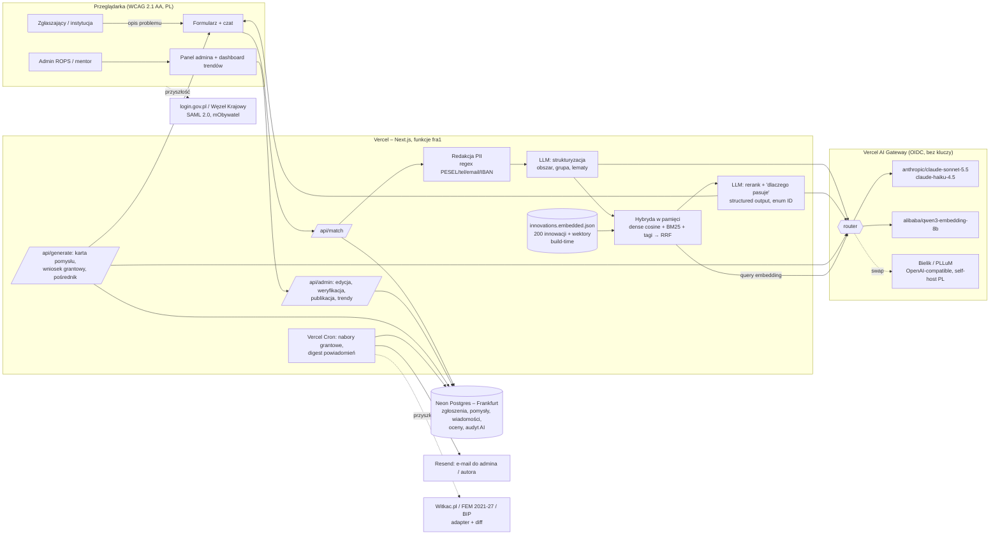

# HubMI.pl: architecture, AI stack for Polish, hosting and cost model

Track 04 research. Written Sun 4 Oct 2026, ~06:55 CEST. Prices were checked online today. Items marked **(verify)** are uncertain or come from secondary sources.
Exchange rate: **NBP table 192/A/NBP/2026 (2 Oct 2026): 1 USD = 3.8881 PLN, 1 EUR = 4.3745 PLN**. Fetched from `api.nbp.pl`.

---

## TL;DR: one stack, one pipeline

**Stack: Next.js (App Router, TypeScript) + Vercel AI SDK on Vercel (functions pinned to `fra1`), Vercel AI Gateway with OIDC auth (no API keys), and Neon Postgres (Frankfurt) provisioned with `vercel integration add neon`. Resend handles email notifications.**

- Why this stack fits our machine: the Vercel CLI v54 is already logged in, and the supabase, fly and railway CLIs are missing. Neither deploying nor provisioning needs a new CLI. On Vercel deployments, AI Gateway authenticates through OIDC. For local dev, `vercel env pull .env.local` writes a `VERCEL_OIDC_TOKEN` that lasts about 24 h. No provider keys are needed anywhere.
- **The 200-item library does not need a vector database.** We embed it once at build time into `data/innovations.embedded.json`. Search then runs in memory inside the function: about 200 × 1024 floats, so cosine similarity over everything takes under 1 ms. Postgres stores only what users create: problem reports, ideas, messages, ratings and admin edits. That data feeds the trend dashboard.
- **Matchmaking pipeline, built in about 1 h:**
  1. **PII redaction** (regex) runs before anything reaches an LLM.
  2. **LLM structuring.** The problem text becomes JSON with `obszar_tematyczny`, `grupa_docelowa`, `slowa_kluczowe` (lemmas plus synonyms), `skala` and `podsumowanie`.
  3. **Hybrid retrieval.** Dense cosine over precomputed embeddings is combined with BM25 (MiniSearch) over lemmatised text, using a light Polish prefix stemmer and the LLM's lemmas as query expansion. A tag-overlap boost is added and the lists are fused with **RRF (k = 60)**.
  4. **LLM rerank and explanation.** The top 10 go to the LLM, which returns the top 5 as structured output. It must pick IDs from the candidate list (an enum, so it cannot hallucinate innovations) and give a short Polish rationale for each: "Dlaczego pasuje", the matched keywords, and "Co trzeba dostosować". Retrieval results appear immediately and the explanation streams in afterwards.
- **Models through the Gateway:**
  - **Generation:** `anthropic/claude-sonnet-5.5` ($2 / $10 per 1M input / output tokens). Use `anthropic/claude-haiku-4.5` ($1 / $5) for cheaper structuring and reranking.
  - **Embeddings:** `alibaba/qwen3-embedding-8b` ($0.01 per 1M tokens). Among Gateway-available models it has the best Polish evidence (PIRB avg 60.93). It is also open-weight under Apache 2.0, so it can later be self-hosted in Poland. Alternatives: `cohere/embed-v4.0` ($0.12) and `openai/text-embedding-3-large` ($0.13).
- **"Sovereign" story for the jury:** the provider is swappable in one line. The AI SDK uses `provider/model` strings, and Bielik or PLLuM can be plugged in through any OpenAI-compatible endpoint. Polish open models (Bielik 11B v3, Apache 2.0; PLLuM) can be self-hosted on Polish infrastructure such as Cyfronet/PLGrid or an EU cloud. Embeddings can switch to `sdadas/stella-pl-retrieval` or `mmlw-retrieval-roberta-large`, both from OPI PIB, a Polish national research institute.
- **Keyless fallback, in case Gateway credit is blocked:**
  - **Fallback A:** BM25 plus tag matching, with deterministic explanations ("dopasowane słowa: …"), and no LLM. The precomputed document embeddings still power the "podobne innowacje" (similar innovations) view.
  - **Fallback B:** run `onnx-community/embeddinggemma-300m-ONNX` (PIRB 55.22) or `onnx-community/Qwen3-Embedding-0.6B-ONNX` through transformers.js, at build time and also for query embedding in a Node function.
- **Pilot cost (1 000 users, 500 reports per month): about 517 PLN/month for infrastructure plus AI** (about 389 PLN optimised), **plus about 6 900 PLN for staff (0.45 FTE)**. **Region scale (50 000 users, 10 000 reports): about 7 450 PLN/month for infrastructure plus AI** (about 4 900 PLN optimised), **plus about 22 500 PLN for staff (1.6 FTE).** The tables are in section 6.
- **Blockers for the human team in the first 10 minutes:**
  1. Enable AI Gateway on the Vercel team. Per the Vercel FAQ, free credits may return `403 customer_verification_required` until **a payment method is on file**. A person has to add the card; the agent must not.
  2. Check whether `anthropic/claude-sonnet-5.5` is in the **free-tier model subset (verify)**. If it is not, buy $10–20 of credits. The whole hackathon will use less than $5 of tokens. Buying credits moves the team to the paid tier, and the monthly $5 free credit stops.
  3. Run `vercel integration add neon`. This creates a Neon account through the Marketplace, which requires accepting terms, so **a human runs it**. Choose the Frankfurt region.

---

## 1. Architecture diagram

The Next.js app is plain Node with standard Postgres, so it **can be containerised** (`next build` with `output: 'standalone'` plus Docker). For production it can move off Vercel to a Polish or EU host. That supports the "no lock-in" argument in the implementation-potential criterion.

---

## 2. Retrieval pipeline for Polish

### 2.1 Embedding models: evidence from PIRB (41 Polish retrieval tasks, NDCG@10)

| Model | Params | PIRB avg | Source | On AI Gateway? | Notes |
|---|---|---|---|---|---|
| BGE-Multilingual-Gemma2 | 9.2B | **63.26** | 2026 paper (Table 1) | no | too large to self-host cheaply |
| `sdadas/stella-pl-retrieval` | 1.5B | **62.32** | model card | no | Polish (OPI PIB), self-host; the 2026 paper warns its scores may be inflated by training-data overlap |
| `alibaba/qwen3-embedding-8b` | 7.6B | **60.93** | 2026 paper | **yes, $0.01/1M** | **recommended via Gateway**; Apache 2.0, self-hostable |
| `alibaba/qwen3-embedding-4b` | 4B | 59.19 | 2026 paper | yes, $0.02/1M | |
| `sdadas/mmlw-retrieval-roberta-large` | 435M | 58.46 | model card | no | Polish; self-host; query prefix `zapytanie: ` |
| `intfloat/multilingual-e5-large` | 560M | 57.29 | 2026 paper and PIRB 2024 | no | |
| `sdadas/mmlw-retrieval-roberta-base` | 124M | 56.38 | model card | no | small enough for a CPU build step |
| BGE-M3 | 568M | 55.75 | 2026 paper | no | |
| EmbeddingGemma-300M | 300M | 55.22 | 2026 paper | no (ONNX for transformers.js exists) | **keyless fallback B** |
| multilingual-e5-base / small | 278M / 118M | 53.12 / 50.65 | 2026 paper | no | |
| BM25 | – | 45.71 (2026) / 41.85 (2024) | papers | – | lexical baseline; the two papers use different configurations |
| OpenAI `text-embedding-3-large` / `-small` | – | **not in PIRB (verify)** | – | yes, $0.13 / $0.02 per 1M | safe default, but no Polish-specific evidence |
| Cohere `embed-v4.0` | – | **not in PIRB (verify)** | – | yes, $0.12/1M | strong multilingual track record |

Rerankers:
- `sdadas/polish-reranker-large-ranknet` reaches **62.65** in PIRB's reranker category (model card).
- Cohere `rerank-v4-pro`/`-fast` are on the Gateway (Cohere direct price $0.0025 / $0.002 per search; verify the Gateway price).
- `bge-reranker-v2-m3` needs self-hosting.
- **For a 200-document library, an LLM rerank of the top 10 is the simplest and best option.** It also produces the explanation that judges will look for. The PIRB authors note that cross-encoder rerankers manage only 2–5 queries/s on their hardware. Hybrid sparse + dense retrieval recovers much of that gain cheaply.

**Comparability warning:** the 2026 paper (arXiv 2609.12913) and the model cards may use different PIRB versions or settings. Treat differences of about 2 points as noise **(verify)**.

### 2.2 Lexical channel and Polish morphology

Judges test relevance using **keywords** from a need description, so the lexical channel matters as much as the dense one. Polish inflection breaks naive matching: "samotni seniorzy" should match "samotność osób starszych".
- **Postgres has no built-in Polish stemmer.** Polish ispell/hunspell dictionaries (judehunter/polish-tsearch, pg_hunspell) must be copied into `tsearch_data`, which is **not possible on managed Neon or Supabase (verify for Neon)**. According to depesz, a Polish configuration was committed for **PostgreSQL 19** in January 2026 **(verify release timing)**. `pg_trgm` and `unaccent` are available on managed Postgres and give fuzzy matching.
- **What we do instead (in memory, about 30 lines):**
  1. **At build time**, a Python step (`uv run`) lemmatises the 200 entries. Options are `simplemma` (pure Python, supports `pl`) or spaCy `pl_core_news_md`. The lemmas go into a `lemmas` field in the JSON.
  2. **At query time**, the LLM structuring call returns `slowa_kluczowe` as **base-form lemmas plus 3–5 synonyms**. That is our lemmatiser, and it also expands the query.
  3. MiniSearch (or wink-bm25) indexes `title^3, tags^2, lemmas, summary`. A custom `processTerm` lowercases each token, strips diacritics into a second token, and **truncates to a 6-character prefix**, a crude but effective Polish light stemmer. MiniSearch fuzzy matching (0.2) and prefix search are enabled.
  4. **Tag boost:** if the query's `obszar_tematyczny` or `grupa_docelowa` matches the entry's controlled-vocabulary tags, add +1 RRF-equivalent rank.
- **Fusion:** `score = Σ 1/(60 + rank_i)` over the dense, BM25 and tag lists. Supabase's documented `hybrid_search` uses the same RRF pattern (k = 50, full-text and semantic weights), so we can cite it as the production path when moving to pgvector.

### 2.3 LLM structuring, explanation and guardrails

- Use the AI SDK's `generateObject` / structured output with a Zod schema. Areas come from a closed list taken from the library, for example "senioralne", "niepełnosprawność", "młodzież", "wykluczenie cyfrowe", "bezdomność", "zdrowie psychiczne", "rodzina" and "aktywizacja zawodowa". The data teammate should finalise the list.
- Reranking runs as structured output: `{ wyniki: [{ id: enum(candidateIds), trafnosc: 1-5, dlaczego: string, dopasowane_elementy: string[], co_dostosowac: string }] }`. Because `id` is an enum, the model cannot invent innovations. Show `trafnosc` as text, not as a colour alone (WCAG).
- **"Why this match" layer for the UI:** combine (a) the deterministic evidence, meaning matched lemmas highlighted in the description, the shared area and target group, and the cosine similarity bucket ("wysokie / średnie podobieństwo"), with (b) the LLM sentence. If the LLM fails, (a) is shown alone.
- **Similar cases:** problem reports stored in Postgres are embedded too (store the vector as `real[]`, or use `vector(1024)` with pgvector on Neon). New reports show "Podobne zgłoszenia z regionu" and feed the trend dashboard: counts by `obszar` × powiat × month.
- **AI Act labelling:** every AI-generated block gets a badge "Treść wygenerowana przez AI – wymaga weryfikacji" (AI-generated content, needs verification), and a log row records the model, prompt version and timestamp.

### 2.4 Keyless fallbacks (no Gateway access)

| Level | What works | How |
|---|---|---|
| A (zero AI at runtime) | BM25 + tags + deterministic explanation; "similar innovations" from precomputed vectors | Build-time embeddings computed locally with `uv run` + `sentence-transformers` + `sdadas/mmlw-retrieval-roberta-base` (Polish, 124M, CPU-friendly), stored in the JSON. Query-time dense retrieval is disabled because no matching query encoder is available. |
| B (keyless dense) | Full hybrid retrieval, no generation | transformers.js (`@huggingface/transformers`) with `onnx-community/embeddinggemma-300m-ONNX` or `Qwen3-Embedding-0.6B-ONNX`, used both at build time and in a Node (not Edge) function. Risks: function bundle size and a slow cold start while the model downloads to `/tmp` **(verify Vercel limits)**. The `Xenova/multilingual-e5-*` ONNX exports have a known transformers.js pipeline issue (#267), so avoid them. |
| C | Generation | Not possible without credentials: the local Ollama has only tiny models. Show the "AI niedostępne" state and use templated idea cards and grant skeletons (Mustache templates filled from the form). |

---

## 3. LLM comparison (generation: grant draft, middleman, idea assistant, structuring)

| Model | Price in / out per 1M tokens | Polish quality | Sovereignty and data | On AI Gateway | Role |
|---|---|---|---|---|---|
| **Claude Sonnet 5.5** (`anthropic/claude-sonnet-5.5`) | **$2 / $10**, cache read $0.20 | very good, long formal Polish | US company; first-party `inference_geo` = `us`/`global` only, no EU pin; EU residency via Bedrock or Vertex EU regions **(verify)** | **yes** | **primary generator** |
| Claude Haiku 4.5 (`anthropic/claude-haiku-4.5`) | $1 / $5 | good | same | yes | structuring and rerank (cost-down) |
| Claude Opus 5.5 | $4 / $20 | best | same | yes | not needed |
| OpenAI GPT-5.4-mini / GPT-5-mini | $0.75 / $4.50; $0.25 / $2 | good | US; OpenAI offers EU data residency for API projects **(verify)** | yes | alternative |
| Google Gemini 3.1 Flash-Lite | $0.25 / $1.50 | good | Vertex EU regions | yes | cheapest generalist |
| Mistral Medium 3.5 / Large 3 / Small | $1.5 / $7.5; $0.5 / $1.5; $0.15 / $0.6 | good | **EU company (France), EU hosting** | yes | "European" option |
| **Bielik 11B v3.0 Instruct** (SpeakLeash + ACK Cyfronet AGH) | open weights, **Apache 2.0**; 4-bit fits one 24 GB GPU; third-party APIs exist (FriendliAI dedicated, Hugging Face, ARK Labs); SpeakLeash sells **no official paid API** | strong Polish for its size; weaker on long reasoning | **Polish, self-hostable** (Cyfronet/PLGrid, OVHcloud, Polish clouds) | **no** | **sovereign option** through an OpenAI-compatible endpoint (vLLM / Ollama) |
| **PLLuM** (HIVE AI consortium, Ministry of Digital Affairs; 11 new models released 21 May 2026, sizes 4B/8B/12B/70B) | mixed licences: Apache 2.0, Llama licence, and CC-BY-NC for `-nc-` variants. An "official API at `portal.pllum.gov.pl` / `api.pllum.gov.pl`" with tiered pricing is **reported only by an unofficial blog (verify)** | tuned for official administrative Polish (20+ document types) | **government-backed, documented for AI Act compliance** | no | best **public-sector narrative**: "ready to switch to PLLuM" |

**Recommendation:** use Claude Sonnet 5.5 through the Gateway for the demo, because it gives the best Polish for long documents and needs zero setup. In the pitch, say: "Warstwa LLM jest wymienna: produkcyjnie możliwe uruchomienie na PLLuM lub Bielik w polskiej infrastrukturze" (the LLM layer is swappable; in production it can run on PLLuM or Bielik on Polish infrastructure). The AI SDK model string and an `OPENAI_COMPATIBLE_BASE_URL` env var make the swap a configuration change. **Do not try to self-host Bielik during the hackathon.**

---

## 4. Stack comparison (3-hour build, public link)

| Option | Build speed with Claude Code | Deploy and DB on our machine | WCAG friendliness | Free tier and demo stability | EU residency | Verdict |
|---|---|---|---|---|---|---|
| **Next.js + Vercel + AI Gateway + Neon (Marketplace)** | very high (AI SDK `generateObject`, streaming, shadcn/Radix accessible primitives) | **Vercel CLI already logged in; `vercel integration add neon`; OIDC, no keys** | high (Radix/shadcn ARIA, server-rendered HTML) | Hobby is free but **non-commercial only** (fine for a demo; the institution would need Pro at $20 per seat). Neon free tier: 1 GB, 100 CU-h, **does not pause for a week like Supabase free** | functions in `fra1`; Neon `aws-eu-central-1` | **RECOMMENDED** |
| Next.js + Vercel + Supabase | high; also gives auth, storage and a Table Editor usable as a free admin UI | no Supabase CLI; would need the dashboard or Marketplace | high | free projects **pause after 1 week of inactivity**, which risks the demo link going dark before judging; Pro $25 | Frankfurt / Ireland | strong alternative for production (auth, RLS) |
| FastAPI or Streamlit on Render / Fly / Railway / HF Spaces | medium; Streamlit is fast but weak for WCAG and custom UI | CLIs not installed; HF Spaces needs an HF token | **Streamlit is poor for WCAG 2.1 AA** | free tiers sleep (slow cold start) | varies | not recommended |
| Python (uv) only for build-time scripts | – | uv and Python 3.14 are available | – | – | – | **use for lemmatisation and embedding preprocessing only** |

---

## 5. Integrations and security / compliance

### 5.1 Notifications

- **Email: Resend.** Free tier: 3 000 emails/month, 100/day. Pro: $20 for 50k or $35 for 100k. Events: a new idea or report triggers an email to the admin; an admin reply triggers an email to the author with a link to the thread; a weekly digest goes out; a grant-call change triggers an alert to subscribers. Run the jobs with Vercel Cron. Alternative: AWS SES in `eu-central-1` (about $0.10 per 1k, **verify**).
- **SMS** (optional and future): a Polish gateway such as SMSAPI.pl at about 0.1–0.17 PLN per SMS **(verify)**. Do not build it in 3 hours.
- **In-app:** a notifications table plus a badge. Realtime is not needed.

### 5.2 Grant database

- **Witkac.pl** is a grant-competition platform used by many local governments. **No public API is documented.** Its statistics module offers spreadsheet exports, and operators state that "other data" can be shown "after agreement with the operators". In practice that means a data-sharing agreement or exports with ROPS/UMWM, contact bok@witkac.pl.
- Other sources: regional programme calls (FEM 2021–2027, Małopolska), funduszeeuropejskie.gov.pl and BIP announcements. Scraping requires a ToS check **(verify)**.
- **MVP design for "integration readiness":** a `grant_calls(source, external_id, title, deadline, amount, area_tags, url, hash, updated_at)` table, plus a `GrantSourceAdapter` interface with `fetch()` → normalise → upsert by hash → diff → notify. Ship one adapter backed by **mocked JSON, clearly labelled as simulated**, and a Vercel Cron job. Show the "Zmiana w naborze" notification in the demo.

### 5.3 Login (future integration only)

- **login.gov.pl / Węzeł Krajowy:** integration uses SAML 2.0. Public entities providing e-services have been obliged to integrate since 1 Jan 2022. COI provides test certificates, and a typical integration takes about 1.5 months. Users can sign in through it with mObywatel, banking (mojeID), e-ID and Profil Zaufany. **For the MVP, do not build user accounts.** Use anonymous submissions with an optional e-mail address, and an admin route behind a single passcode or Vercel Deployment Protection. In the mockups and docs, show a "Zaloguj przez login.gov.pl" button as the roadmap.

### 5.4 GDPR

- **Data minimisation:** the form asks only for the problem description, area, powiat (county) and an optional contact e-mail. Visible copy says: "Nie podawaj danych osobowych ani danych o zdrowiu konkretnych osób" (do not give personal data or health data about specific people).
- **PII redaction before the LLM and before storage:** regexes for PESEL (11 digits, checksum), Polish phone numbers (`(\+48)?\s?\d{3}[\s-]?\d{3}[\s-]?\d{3}`), e-mails, IBAN `PL\d{26}`, NIP, postcodes plus street patterns, and capitalised name-surname pairs (best effort). Replace matches with `[DANE USUNIĘTE]`. Store only the redacted text. The structuring LLM also has an instruction to flag `zawiera_dane_osobowe: true` so the admin can review. For production, add NER-based redaction such as spaCy `pl_core_news` `persName`.
- Problem descriptions in social welfare can reveal **special-category data (Art. 9, e.g. health)**. For production we need a **DPIA (Art. 35)**, DPAs with Vercel, Neon, the AI provider and Resend, EU regions, and retention limits (for example, delete raw reports after 24 months and keep aggregates). On the Gateway, per-request **Zero Data Retention** routing and disallowing prompt training are available on Pro/Enterprise. Vercel says the Gateway itself does not retain prompts.
- **No real personal data:** seed data is synthetic and labelled "dane przykładowe" (sample data).

### 5.5 EU AI Act

- **Art. 50 transparency has applied since 2 Aug 2026.** The Digital Omnibus did not delay it. Users must be told they are interacting with AI, and AI-generated text must be disclosed or marked. The machine-readable marking deadline for legacy generative systems is 2 Dec 2026 **(verify details)**.
- **What we implement:** a chat banner ("Rozmawiasz z asystentem AI"), badges on AI output, an "AI draft → human review → publish" workflow in the admin panel (human oversight), and an AI usage log.
- **Risk class:** Annex III point 5(a) treats as high-risk any system that public authorities use to *evaluate eligibility for public assistance benefits*. HubMI only **recommends innovations and drafts documents**, so it is **likely not high-risk**. That holds only if we keep it away from scoring individuals or deciding on benefits **(verify with legal)**. High-risk obligations are postponed to 2 Dec 2027 anyway.
- **Art. 4 AI literacy** for the deployer's staff (ROPS) has applied since Feb 2025. Mention training for mentors and admins in the cost model.

### 5.6 Accessibility law (flag only; another teammate covers it)

- *Ustawa z 4 kwietnia 2019 r. o dostępności cyfrowej stron internetowych i aplikacji mobilnych podmiotów publicznych* applies to the voivodeship and ROPS. It requires WCAG 2.1 AA (EN 301 549) and a published **deklaracja dostępności** (accessibility statement). Budget for this in maintenance.

---

## 6. Cost model (ready to paste; in Polish)

**Assumptions per operation** (Claude Sonnet 5.5 at $2 / $10 per 1M; Haiku 4.5 at $1 / $5; embeddings Qwen3-8B at $0.01/1M; exchange rate 3.8881):

| Operacja AI | Tokeny wej. / wyj. (szac.) | Koszt / operację (Sonnet 5.5) | Wariant oszczędny |
|---|---|---|---|
| Matchmaking (strukturyzacja + rerank + uzasadnienie) | 6 000 / 1 200 | 0,024 USD (0,09 PLN) | Haiku 4.5: 0,012 USD (0,05 PLN) |
| Generator wniosku grantowego | 3 000 / 4 000 | 0,046 USD (0,18 PLN) | – |
| Pośrednik innowacji (adaptacja dla instytucji) | 3 000 / 2 500 | 0,031 USD (0,12 PLN) | – |
| Asystent pomysłu (sesja ~6 wymian) | 24 000 / 3 600 | 0,084 USD (0,33 PLN) | z cache promptu: ~0,055 USD |
| Embedding zapytania / zgłoszenia | ~500 / – | <0,00001 USD | – |
| Jednorazowe zwektoryzowanie biblioteki (200 innowacji) | 120 000 | 0,0012 USD (Qwen3-8B) / 0,016 USD (OpenAI 3-large) | – |

**Monthly volumes:**
- **Pilot:** 1 000 users, 500 reports, 2 000 searches, 100 grant drafts, 150 middleman adaptations, 300 idea-assistant sessions.
- **Region:** 50 000 users, 10 000 reports, 40 000 searches, 2 000 grant drafts, 3 000 adaptations, 6 000 sessions.

### Miesięczny koszt utrzymania – HubMI.pl

| Pozycja | Pilotaż (1 000 użytk./mies.) | Skala województwa (50 000 użytk./mies.) | Uwagi |
|---|---|---|---|
| Hosting aplikacji (Vercel Pro, region fra1) | 20 USD / **78 PLN** | 90 USD / **350 PLN** | Pro 20 USD/os.; region: 2 stanowiska + nadwyżki transferu/funkcji (szac.) |
| Baza danych Postgres (Neon / Supabase, Frankfurt) | 25 USD / **97 PLN** | 110 USD / **428 PLN** | pgvector w cenie; region: większa instancja + PITR **(do weryfikacji)** |
| Modele językowe – generowanie (Claude Sonnet 5.5 przez AI Gateway, bez marży) | 84 USD / **327 PLN** | 1 661 USD / **6 458 PLN** | wariant oszczędny (Haiku do matchingu + cache): 51 USD / 198 PLN i 1 008 USD / 3 919 PLN |
| Embeddingi (wyszukiwanie semantyczne) | 1 USD / **4 PLN** | 2 USD / **8 PLN** | Qwen3-Embedding-8B 0,01 USD / 1 mln tokenów |
| Powiadomienia e-mail (Resend) | 0 USD / **0 PLN** | 20 USD / **78 PLN** | darmowe 3 000/mies.; Pro 50 000/mies. |
| Monitoring i logi (Vercel Observability, Sentry) | 0 USD / **0 PLN** | 30 USD / **117 PLN** | plan darmowy w pilotażu **(do weryfikacji)** |
| Domena, certyfikat, kopie | 3 USD / **12 PLN** | 3 USD / **12 PLN** | |
| **Razem infrastruktura + AI** | **133 USD / 517 PLN** | **1 916 USD / 7 450 PLN** | oszczędnie: **100 USD / 389 PLN** i **1 263 USD / 4 911 PLN** |
| Zespół utrzymaniowy | 0,2 etatu dewelopera + 0,25 etatu moderatora treści = **6 900 PLN** | 0,5 etatu dewelopera + 1,0 etatu moderatora/redaktora wiedzy + 0,1 etatu IOD/bezpieczeństwo = **22 500 PLN** | założenia: deweloper 22 000 PLN/etat (B2B), moderator 10 000 PLN/etat, IOD 15 000 PLN/etat (koszt pracodawcy) **(do weryfikacji)** |
| **RAZEM miesięcznie** | **≈ 7 400 PLN (≈ 1 910 USD)** | **≈ 29 950 PLN (≈ 7 700 USD)** | AI i infrastruktura to ~7% (pilotaż) i ~25% (region) kosztu; dominuje praca ludzi |

**Opcja suwerenna** (optional line for the slide): self-hosting Bielik 11B or PLLuM-12B on one 24 GB GPU (L4 class) in an EU or Polish cloud running 24/7 costs roughly **600–800 USD/month (2 300–3 100 PLN) (verify)**. The cost is fixed and does not grow with volume, so it pays off from roughly region scale upwards. Another option is free compute grants from Cyfronet/PLGrid for public-research partnerships.

**Scalability note for the slide:** the app layer is stateless serverless functions that scale automatically. Search over the library runs in memory, at under 10 ms for 200–5 000 entries; beyond that we move it to pgvector HNSW plus full-text with RRF. AI costs scale linearly per operation and are capped by Gateway budgets and per-user rate limits.

---

## 7. Risks and mitigations

| Risk | Impact | Mitigation |
|---|---|---|
| AI Gateway free credit needs a payment method; Sonnet 5.5 may be outside the free-tier subset **(verify)** | no generation in the demo | a human enables it in the first 10 minutes; buy $10–20 of credits; fallback levels A, B and C (section 2.4) |
| Vercel Hobby is non-commercial | none for the hackathon; matters for production | budget for Pro in the cost table (done) |
| Supabase free pauses after 7 days | demo link dies before judging | use Neon (scales to zero, wakes in about 1 s) |
| LLM invents innovations or IDs | lost credibility | enum of candidate IDs in the structured output; render data only from the JSON |
| Polish inflection breaks keyword tests | low relevance in the judges' tests | LLM lemmas, 6-character prefix stemming, fuzzy BM25, tag boost, dense channel |
| LLM latency of 3–8 s | poor UX | show the hybrid results immediately, then stream the explanations |
| Claude has no EU-pinned inference on the first-party API | public-sector objection | answer with the swappable provider, the Bedrock/Vertex EU route **(verify)**, Mistral as the EU option, and Bielik/PLLuM self-hosting |
| PLLuM API facts are unverified | wrong claim in the pitch | describe it only as "PLLuM-ready", not as integrated |
| Witkac has no public API | the integration claim is weak | present an adapter interface plus mocked data plus a data-sharing agreement on the roadmap |
| Special-category data in problem reports | GDPR exposure | redaction, warnings, DPIA on the roadmap, synthetic data only |
| transformers.js bundle size or cold start on Vercel | fallback B may fail | use fallback A (BM25-only), which needs no model at runtime |

---

## Sources

- Claude model IDs and prices: Anthropic `claude-api` skill (cached 25 Sep 2026); <https://platform.claude.com/docs/en/about-claude/pricing>. Cache read about 0.1× base input, 0.05× on Opus 5.5; batch API 50% off. Live AI Gateway catalog: `curl https://ai-gateway.vercel.sh/v1/models`, fetched 4 Oct 2026, which confirms `anthropic/claude-sonnet-5.5` at $2/$10, `claude-haiku-4.5` at $1/$5, `openai/gpt-5.4-mini`, `mistral/*`, and the embedding prices.
- AI Gateway pricing (no markup, free versus paid tier, BYOK, ZDR add-ons): <https://vercel.com/docs/ai-gateway/pricing>. FAQ (payment method needed for free credits, free-tier subset, no prompt retention): <https://vercel.com/docs/ai-gateway/faq>. Embedding and reranker catalog: <https://vercel.com/ai-gateway/models?type=embedding>. $5 per 30 days free credit (secondary source, verify): <https://agentjournal.dev/blog/vercel-ai-gateway-free/>, <https://vercel.com/blog/ai-gateway-is-now-generally-available>
- PIRB: <https://arxiv.org/abs/2402.13350>. 2026 PIRB results table: <https://arxiv.org/html/2609.12913>. Model cards: <https://huggingface.co/sdadas/stella-pl-retrieval>, <https://huggingface.co/sdadas/mmlw-retrieval-roberta-large>, <https://huggingface.co/sdadas/mmlw-retrieval-roberta-base>, <https://huggingface.co/sdadas/polish-reranker-large-ranknet>. PL-MTEB: <https://arxiv.org/abs/2405.10138>
- Supabase hybrid search (RRF): <https://supabase.com/docs/guides/ai/hybrid-search>. Supabase pricing and regions: <https://supabase.com/docs/guides/platform/regions>, <https://makerkit.dev/blog/saas/supabase-pricing>
- Polish tsearch: <https://github.com/judehunter/polish-tsearch>, <https://github.com/EvanCarroll/pg_hunspell>, <https://www.depesz.com/2026/04/21/polish-configuration-for-tsearch/>
- transformers.js ONNX models: <https://huggingface.co/onnx-community/embeddinggemma-300m-ONNX>, <https://huggingface.co/onnx-community/Qwen3-Embedding-0.6B-ONNX>, issue with the mE5 exports: <https://github.com/xenova/transformers.js/issues/267>
- Neon on Vercel Marketplace and CLI: <https://vercel.com/marketplace/neon>, <https://neon.com/blog/neon-skills-landed-in-the-vercel-cli>, plans: <https://neon.com/docs/introduction/plans>, pgvector: <https://neon.com/docs/extensions/pgvector>
- Vercel plans (Hobby non-commercial, Pro $20 per seat): <https://vercel.com/pricing>, <https://costbench.com/software/developer-tools/vercel/>
- Resend pricing: <https://resend.com/pricing>, <https://nuntly.com/resend-pricing>
- OpenAI and Cohere embedding prices: <https://openai.com/api/pricing/>, <https://cohere.com/pricing>, <https://pecollective.com/tools/cohere-pricing/>. Mistral: <https://mistral.ai/pricing>, <https://www.cloudzero.com/blog/mistral-api-pricing/>
- Bielik: <https://huggingface.co/speakleash>, <https://bielik.ai/jak-korzystac-z-bielika/>, <https://friendli.ai/models/speakleash/Bielik-11B-v3.0-Instruct>, <https://syntalith.ai/en/blog/bielik-polish-open-source-llm-for-business-2026>
- PLLuM: <https://itwiz.pl/udostepniono-11-nowych-modeli-pllum-otwartych-polskich-llm-dla-administracji-i-biznesu/> (release 21 May 2026), <https://ai.gov.pl/aktualnosci/nowe-modele-pllum>, <https://huggingface.co/CYFRAGOVPL/PLLuM-12B-nc-instruct>, <https://pl.wikipedia.org/wiki/PLLuM>. API claims (unofficial, verify): <https://ainarzedziapolska.lovable.app/blog/pllum-api-poradnik-2026>
- EU AI Act Art. 50: <https://artificialintelligenceact.eu/transparency-rules-article-50/>, <https://www.goodwinlaw.com/en/insights/publications/2026/08/alerts-technology-dpc-eu-ai-act-transparency-obligations-now-in-force>, <https://www.joneswalker.com/en/insights/blogs/ai-law-blog/yes-august-2-still-matters-the-eu-approved-a-high-risk-ai-delay-but-most-trans.html?id=102nbon>
- Witkac.pl: <https://witkac.pl/strona/s/funkcje.html>, <https://www.mazowieckieobserwatorium.pl/wydarzenia/2390-witkac.html>
- Węzeł Krajowy: <https://www.gov.pl/web/cyfryzacja-badania-i-projektowanie-wezel-krajowy>, <https://www.gov.pl/attachment/d40ddfc9-74c1-4b78-bde1-e0d0d96545e6>, <https://vobacom.pl/blog/logowanie-do-wezla-krajowego-z-poziomu-cms-drupal>
- NBP rates: <https://api.nbp.pl/api/exchangerates/tables/A/> (table 192/A/NBP/2026)
